# 风机功率与集电线路功率层级关系分析报告

**场站：峡阳B（Xia Yang B）**  
**分析数据时段：2024-03-15 ～ 2024-12-24**（全量数据，共 9.4 个月）  
**数据记录数：407,519 条（分钟级 SCADA 记录）**  
**分析脚本：`#7-2功率层级关系分析.py`**

> **重要更新（2024-03-17）**：经风场风机主管确认，全站功率（ACTIVE_POWER_STATION）
> 由集电线路有功汇总计算得到，且该测点在 2024-03 至 2024-06 整段时间持续缺失。
> 因此报告已移除全站功率相关分析，改为**仅分析风机汇总功率 vs 集电线路测点功率**
> 的关系，同时扩展至全量时段（2024-03-15 起）。
>
> **功率口径说明**：风机不发电时会消耗厂用电（自耗电），厂用电由独立电源供给，
> 与集电线路彼此独立。因此计算风机功率和时，将负值（厂用电模式）置0，
> 即 **S2 策略（负值置0）是正确的业务口径**。

---

## 目录

1. [背景与分析范围](#1-背景与分析范围)
2. [数据概览与字段说明](#2-数据概览与字段说明)
3. [功率方向约定与分析策略](#3-功率方向约定与分析策略)
4. [风机与集电线路功率汇总统计](#4-风机与集电线路功率汇总统计)
5. [三条集电线路传输损耗对比——核心分析](#5-三条集电线路传输损耗对比核心分析)
   - 5.1 [总体传输损耗对比](#51-总体传输损耗对比)
   - 5.2 [分功率区间传输损耗（绝对值）](#52-分功率区间传输损耗绝对值)
   - 5.3 [分功率区间传输损耗率（百分比）](#53-分功率区间传输损耗率百分比)
   - 5.4 [三线路差异原因分析](#54-三线路差异原因分析)
6. [月度传输损耗变化](#6-月度传输损耗变化)
7. [非发电状态分析（功率为负的记录）](#7-非发电状态分析功率为负的记录)
8. [核心结论与建议](#8-核心结论与建议)
9. [附录：图表索引](#附录图表索引)

---

## 1 背景与分析范围

### 1.1 分析范围

本报告分析峡阳B风电场 **2024-03-15 至 2024-12-24** 的全量 SCADA 分钟级数据，共 **407,519 条记录**。

> **关于全站功率（ACTIVE_POWER_STATION）**：
> 经风场风机主管确认，全站功率由集电线路有功汇总计算得到，实际上报时也是如此。
> 此外，该测点在 2024-03 至 2024-06 整段时间（约 181,440 条记录）持续为 0，确认
> 为测点未投运或数据缺失阶段。因此 **不再将全站功率作为独立分析对象**，后续全站
> 功率直接由集电线路有功求和计算。

| 时段 | 记录数 | 备注 |
|------|--------|------|
| 2024-03-15 ～ 2024-07-18 | 181,440 | 原含 STATION 测点缺失，现纳入分析（仅关注 Fan vs Line） |
| 2024-07-19 ～ 2024-12-24 | 226,079 | STATION 测点部分投运，但不再使用 |
| **全量合计** | **407,519** | **本报告分析范围** |

### 1.2 场站结构与风机厂商信息

峡阳B 共有 **137 台风机**，按集电线路分为三组：

| 集电线路 | 风机编号 | 台数 | 集电线路测点 | 对应风机汇总列 |
|----------|---------|------|------------|-------------|
| **BING（丙线）** | 153 ～ 199 号 | 47 台 | `ACTIVE_POWER_BING` | `BING_ACTIVE_POWER_SUM_S2` |
| **DING（丁线）** | 110 ～ 152 号 | 43 台 | `ACTIVE_POWER_DING` | `DING_ACTIVE_POWER_SUM_S2` |
| **WU（戊线）**  | 63 ～ 109 号  | 47 台 | `ACTIVE_POWER_WU`   | `WU_ACTIVE_POWER_SUM_S2`  |

#### 各线路风机厂商与型号详情

| 集电线路 | 厂商 | 型号 | 台数 | 单机容量 (MW) | 该线路装机容量 (MW) |
|----------|------|------|------|------------|-----------------|
| **WU（戊线）** | 明阳 | MySE6.45-180 | 47 | 6.45 | **303.15** |
| **BING（丙线）** | 明阳 | MySE6.45-180 | 15 | 6.45 | — |
| **BING（丙线）** | 明阳 | MySE5.5-155  | 1  | 5.5  | — |
| **BING（丙线）** | 金风 | GW171/6450   | 31 | 6.45 | **302.20** |
| **DING（丁线）** | 东气 | DEW-D7000-184 | 43 | 7.00 | **301.00** |

#### ⚠️ 关键差异：明阳风机有功功率包含风机自耗电

> **经风场主管确认**：明阳风机（MySE6.45-180、MySE5.5-155）的 SCADA 有功功率测点
> 计算口径为**总发电功率（含风机本身的内部自耗电）**，即集成了机舱内变频器、冷却系统、
> 液压系统、偏航控制等辅机耗电。东气风机（DEW-D7000-184）和金风风机（GW171/6450）
> 的 SCADA 有功功率测点则**不包含**风机本身自耗电，仅测量送往集电线路的净有功。

这一测量口径差异直接导致三条线路"传输损耗"出现系统性差异（WU > BING > DING），
具体分析见 [章节 5.4](#54-三线路差异原因分析)。

| 线路 | 明阳台数 / 总台数 | 明阳装机 / 总装机 | 自耗电影响程度 |
|------|---------------|---------------|-------------|
| **WU** | 47 / 47（100%）| 303.15 / 303.15 MW（100%）| **最高** |
| **BING** | 16 / 47（34%）| 102.25 / 302.20 MW（34%）| **中等** |
| **DING** | 0 / 43（0%）  | 0 / 301.00 MW（0%）      | **无**   |

---

## 2 数据概览与字段说明

### 2.1 核心字段

| 字段名 | 含义 | 单位 | 正值含义 | 负值含义 |
|--------|------|------|---------|---------|
| `ACTIVE_POWER_BING` | BING 线路测点有功功率 | MW | 向电网输送电力 | 从电网吸收电力（反向潮流）|
| `ACTIVE_POWER_DING` | DING 线路测点有功功率 | MW | 同上 | 同上 |
| `ACTIVE_POWER_WU`  | WU 线路测点有功功率  | MW | 同上 | 同上 |
| ~~`ACTIVE_POWER_STATION`~~ | ~~全站并网点功率~~ | — | **已废弃**：全站功率由集电线路汇总计算，测点历史数据存在大量缺失 | — |
| `BING_ACTIVE_POWER_SUM_S1` | BING 线路所有风机有功之和（含负值） | MW | 风机组合净发电 | 风机组合净耗电 |
| `DING_ACTIVE_POWER_SUM_S1` | DING 线路所有风机有功之和 | MW | 同上 | 同上 |
| `WU_ACTIVE_POWER_SUM_S1`  | WU 线路所有风机有功之和  | MW | 同上 | 同上 |
| `FAN_ACTIVE_POWER_SUM_S1` | 全场所有风机有功之和（含负值）| MW | 全场净发电 | 全场净耗电（厂用电）|
| `FAN_ACTIVE_POWER_SUM_S2` | 全场所有风机有功之和（**负值置0**）| MW | **正确业务口径**：厂用电独立，不计入集电线路 | 0（不发电时）|
| `LINE_ACTIVE_POWER_SUM_S1`| 三条线路测点之和（含负值）| MW | 同上 | 同上 |

> **策略说明**：S1 后缀=原始值（含负），S2 后缀=**负值截零后求和**（业务正确口径）。
> 风机不发电时消耗厂用电，厂用电由独立电源供给，与集电线路彼此独立，
> 因此计算风机功率和与集电线路对比时，**应使用 S2 策略**（本报告从当前版本起统一使用 S2）。

---

## 3 功率方向约定与分析策略

### 3.1 功率正负含义

功率的正负号**代表功率流动方向**，不代表绝对大小：

```
正功率（+）：电力从风机侧 → 集电线路 → 电网
               风机在"发电"，向电网输送电力

负功率（−）：电力从电网 → 集电线路 → 风机侧  
               风机在"耗电"（待机消耗、冷却、变流器维持励磁等）
```

因此：
- **风机有功为负**：该台（或该组）风机处于停机待机状态，从电网消耗少量辅机用电
- **集电线路功率为负**：该线路整体处于从电网受电状态（多数风机停运时）

### 3.2 传输损耗定义

```
传输损耗 = 风机功率汇总（S2，负值置0）− 集电线路测点功率

即：Loss = Fan_sum_S2 − Line_measurement
```

物理含义：风机发出的电力，经过箱式变压器和集电电缆传输到测量点时产生的损耗。
其中 S2 策略确保风机消耗厂用电的情况不会被误计为"负损耗"。

**分析口径**：仅分析 **发电工况**（Fan_sum_S2 > 0 **且** Line_meas > 0）下的传输损耗，排除停机、待机等非发电状态的干扰。

---

## 4 风机与集电线路功率汇总统计

### 4.1 全场功率概况（2024-07-19 至 2024-12-24，共 226,079 条，含 S2 策略新结果）

> 注：以下统计基于 S2 策略（负值置0）。全站功率（STATION）已废弃，不再列入对比。

| 统计量 | FAN_S2 (MW) | LINE_S2 (MW) | 差值 Fan-Line (MW) |
|--------|------------|-------------|-------------------|
| 均值   | 213.46 | 202.96 | **10.50** |
| 标准差 | 233.83 | 227.26 | 8.94 |
| 最小值 | 0.00  | 0.00 | -453.91 |
| 最大值 | 893.45 | 858.76 | 189.82 |
| Pearson r | — | — | **0.9997** |

> 全量 407,519 条记录中，风机 S1 < 0（消耗厂用电）的时刻占 **13.2%**（53,744 条）。
> S2 策略将此时刻风机功率置0，确保厂用电不被计入集电线路对比。

### 4.2 发电工况下各线路功率（Fan>0 且 Line>0）

| 指标 | BING（47 台）| DING（43 台）| WU（47 台）|
|------|------------|------------|-----------|
| 明阳风机台数 | **16 台** | **0 台** | **47 台** |
| 发电记录数 | 171,125（75.7%）| 166,940（73.8%）| 175,941（77.8%）|
| 风机汇总均值 | 102.36 MW | 103.02 MW | 102.89 MW |
| 线路测点均值 | 98.86 MW | 100.56 MW | 95.40 MW |
| **传输损耗均值** | **3.50 MW** | **2.46 MW** | **7.49 MW** |
| **传输损耗率** | **3.42%** | **2.39%** | **7.28%** |

> ⚠️ **关键发现更新**：WU 线路的传输损耗率（7.28%）约为 BING（3.42%）的 2 倍、DING（2.39%）的 3 倍。
> 经风场主管确认，**这一差异的主要原因是明阳风机有功包含了风机本身的内部自耗电**（WU 100% 明阳，BING 约 34% 明阳，DING 无明阳）。详见 [章节 5.4](#54-三线路差异原因分析)。

---

## 5 三条集电线路传输损耗对比——核心分析

### 5.1 总体传输损耗对比

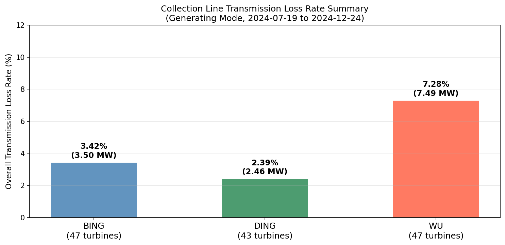

| 线路 | 台数 | 风机厂商 | 发电记录数 | 损耗均值 (MW) | 损耗率 |
|------|------|---------|-----------|------------|------|
| **BING（丙线）** | 47 | 明阳×16 + 金风×31 | 171,125 | 3.50 MW | **3.42%** |
| **DING（丁线）** | 43 | 东气×43（全部）| 166,940 | 2.46 MW | **2.39%** |
| **WU（戊线）**  | 47 | 明阳×47（全部）| 175,941 | 7.49 MW | **7.28%** |

三线路总体损耗（发电模式记录的MW·分钟汇总）：**4.41%**

> **注**：DING 线路（全东气，无自耗电混入）的 **2.39%** 是最接近真实集电电缆和箱变传输损耗的参考值。WU 和 BING 的高损耗主要来自明阳风机 SCADA 有功包含风机内部自耗电。

### 5.2 分功率区间传输损耗（绝对值）

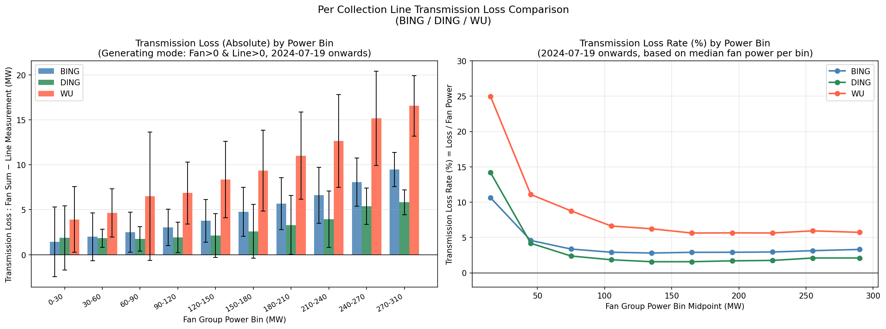

#### 各功率区间详细数据

| 风机功率区间 (MW) | BING 损耗 (MW) | DING 损耗 (MW) | WU 损耗 (MW) | WU/BING 比 | WU/DING 比 |
|--------------|-------------|-------------|-----------|-----------|-----------|
| 0 ～ 30     | 1.44        | 1.87        | 3.92      | 2.73×     | 2.10×     |
| 30 ～ 60    | 2.00        | 1.83        | 4.65      | 2.33×     | 2.54×     |
| 60 ～ 90    | 2.49        | 1.76        | 6.52      | 2.62×     | 3.71×     |
| 90 ～ 120   | 3.03        | 1.92        | 6.86      | 2.27×     | 3.57×     |
| 120 ～ 150  | 3.77        | 2.12        | 8.36      | 2.22×     | 3.94×     |
| 150 ～ 180  | 4.77        | 2.59        | 9.35      | 1.96×     | 3.61×     |
| 180 ～ 210  | 5.67        | 3.31        | 11.02     | 1.95×     | 3.33×     |
| 210 ～ 240  | 6.62        | 3.94        | 12.65     | 1.91×     | 3.21×     |
| 240 ～ 270  | 8.06        | 5.39        | 15.17     | 1.88×     | 2.81×     |
| 270 ～ 310  | 9.47        | 5.83        | 16.56     | 1.75×     | 2.84×     |

**规律**：
1. **BING 和 DING** 损耗绝对值随功率升高而增大，这与线路损耗 $P_{loss} = I^2 R$ 物理规律一致——功率越高，电流越大，电阻损耗越大。
2. **WU 线路**在每个功率区间的损耗绝对值均约为 BING 的 2 倍、DING 的 3 倍，且这一倍数在高功率区间仍然保持，是**系统性而非随机**的现象。**主要原因是 WU 线路全部为明阳风机（SCADA 有功含自耗电），而 DING 全部为东气（不含）、BING 仅约 34% 为明阳。**
3. 三线路的损耗标准差（离散度）也随功率升高而增大，在低功率段波动更为剧烈（测量精度相对误差更大）。

### 5.3 分功率区间传输损耗率（百分比）

以各区间风机功率中位数为基准计算损耗率，排除极小值分母的干扰：

| 风机功率区间 (MW) | BING 损耗率 | DING 损耗率 | WU 损耗率 | 倍差（WU/BING）|
|--------------|----------|----------|---------|-------------|
| 0 ～ 30     | 10.6%    | 14.2%    | 25.0%   | 2.4×        |
| 30 ～ 60    | 4.6%     | 4.2%     | 11.1%   | 2.4×        |
| 60 ～ 90    | 3.4%     | 2.4%     | 8.8%    | 2.6×        |
| 90 ～ 120   | 2.9%     | 1.8%     | 6.6%    | 2.3×        |
| 120 ～ 150  | 2.8%     | 1.6%     | 6.2%    | 2.2×        |
| 150 ～ 180  | 2.9%     | 1.6%     | 5.6%    | 1.9×        |
| 180 ～ 210  | 2.9%     | 1.7%     | 5.7%    | 2.0×        |
| 210 ～ 240  | 2.9%     | 1.8%     | 5.6%    | 1.9×        |
| 240 ～ 270  | 3.1%     | 2.1%     | 5.9%    | 1.9×        |
| 270 ～ 310  | 3.3%     | 2.1%     | 5.7%    | 1.7×        |

**关键规律：**

- **低功率区间（0～30 MW）损耗率特别高**（BING 10.6%、DING 14.2%、WU 25.0%）：  
  这是因为在低功率段，固定损耗（箱变空载铁损、常规辅机用电）占比更大，且测量不确定度相对功率量级更为显著。

- **中高功率区间（60～310 MW）损耗率趋于稳定**：
  - BING：稳定在 **2.8～3.3%**（含 16 台明阳自耗电约 0.3%）
  - DING：稳定在 **1.6～2.1%**（无明阳，最接近真实传输损耗）
  - WU：稳定在 **5.6～8.8%**（含 47 台明阳自耗电约 1.7%）

- **损耗率不随功率明显增大**（中高功率段），说明明阳自耗电与发电功率大致成正比，因此在损耗率上表现为近似常数。DING 线路纯传输损耗率的稳定性也印证了线路物理参数基本固定。

### 5.4 三线路差异原因分析（已确认）

> **经风场主管确认**：三条线路"传输损耗"差异（WU > BING > DING）的根本原因是
> **明阳风机（MySE6.45-180/MySE5.5-155）的 SCADA 有功功率包含了风机本身的内部自耗电**，
> 而东气（DEW-D7000-184）和金风（GW171/6450）风机的 SCADA 有功功率不含风机自耗电。

#### 测量口径差异说明

```
明阳风机 SCADA 有功  =  送往集电线路的净有功  +  风机内部自耗电
                        ↑                     ↑
                    (集电线路 CT 测量到的)   (变频器、冷却、液压、偏航等)

东气/金风风机 SCADA 有功  =  送往集电线路的净有功（仅此一项）
```

因此：
- `FAN_SUM`（风机汇总）- `LINE`（线路测点）= **电缆/变压器传输损耗** + **明阳风机内部自耗电（如有）**
- 对于纯东气线路（DING）：差值 ≈ 纯传输损耗 ≈ **2.46 MW（2.39%）**
- 对于纯明阳线路（WU）：差值 = 纯传输损耗 + **47 台明阳自耗电** ≈ **7.49 MW（7.28%）**
- 对于混合线路（BING）：差值 = 纯传输损耗 + **16 台明阳自耗电** ≈ **3.50 MW（3.42%）**

#### 各线路"额外损耗"量化（以 DING 为纯传输损耗基准）

以 DING 线路（全东气，无自耗电）的平均损耗 **2.46 MW** 作为"纯传输损耗"基准，估算明阳自耗电贡献：

| 线路 | 总损耗均值 | 减去DING基准损耗 | 估算明阳自耗电贡献 | 明阳装机 | 自耗电率估算 |
|------|-----------|-------------|----------------|--------|----------|
| **BING** | 3.50 MW | 3.50 − 2.46 = **1.04 MW** | 1.04 MW / 16台 ≈ **65 kW/台** | 102.25 MW | ~1.0% |
| **WU**   | 7.49 MW | 7.49 − 2.46 = **5.03 MW** | 5.03 MW / 47台 ≈ **107 kW/台** | 303.15 MW | ~1.7% |

> **注意**：上表为粗略估算。BING 和 WU 线路与 DING 线路的电缆阻抗参数本身也可能存在差异，
> 因此"额外损耗"中仍有一部分来自实际线路电阻，不能完全归因于明阳自耗电。
> 需要测量实际电缆参数（长度、截面积）才能精确分解两部分贡献。

#### 与功率区间的关系验证

| 功率区间 | WU/DING 损耗倍比 | 理论预期 |
|---------|---------------|---------|
| 0～30 MW  | 25.0% / 14.2% = **1.76×** | 若自耗电近似常数，低功率区倍比应较大 |
| 60～90 MW | 8.8% / 2.4% = **3.67×** | 中等功率区倍比应偏大（自耗电与功率呈正比）|
| 240～270 MW | 5.9% / 2.1% = **2.81×** | 高功率区倍比应相对稳定 |

> 结论：WU 线路的损耗率在中高功率区间（60 MW 以上）稳定在约 **5.6～8.8%**，其中
> 估算约 **3～5%** 来自明阳风机自耗电（随功率正比变化），其余 **2.4%** 为实际传输损耗（接近 DING 的水平）。

#### 综合结论

**WU 线路损耗偏高已有明确解释：全部 47 台明阳风机的 SCADA 有功包含内部自耗电**，并非测量配置错误或电缆线路异常。类似地，BING 线路的 16 台明阳风机也贡献了约 1 MW 的额外"损耗"。DING 线路（全东气）的约 **2.4%** 损耗率最接近真实的集电电缆和箱变传输损耗水平。

### 5.5 散点图：风机汇总 vs 线路测点

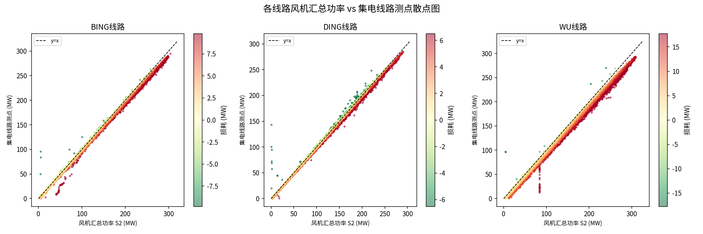

- **BING 和 DING**：散点紧密分布在 y=x 参考线附近，仅有轻微系统偏移（向右偏，Fan>Line），损耗均匀。
- **WU**：散点整体明显偏离 y=x 线，偏移量更大，颜色更深（损耗值更高），且在各功率水平下偏移量均匀地更大，证实是系统性而非随机的损耗偏高。

### 5.6 传输损耗分布直方图

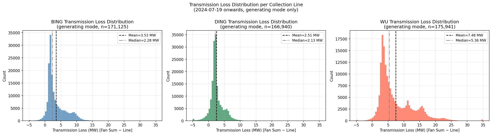

| 线路 | 损耗均值 | 损耗中位数 | 损耗标准差 |
|------|---------|---------|---------|
| BING | 3.50 MW | 2.28 MW | 3.77 MW |
| DING | 2.46 MW | 2.13 MW | 2.78 MW |
| WU   | 7.49 MW | 5.36 MW | 5.94 MW |

- BING 和 WU 的分布右偏（均值 > 中位数），标准差较大，高功率段损耗拉高均值。
- DING 分布最为集中（标准差最小），损耗最为稳定且最低。
- WU 中位数（5.36 MW）也比 BING（2.28 MW）高出一倍以上，确认是系统性偏高而非少数极值造成的假象。

---

## 6 月度传输损耗变化

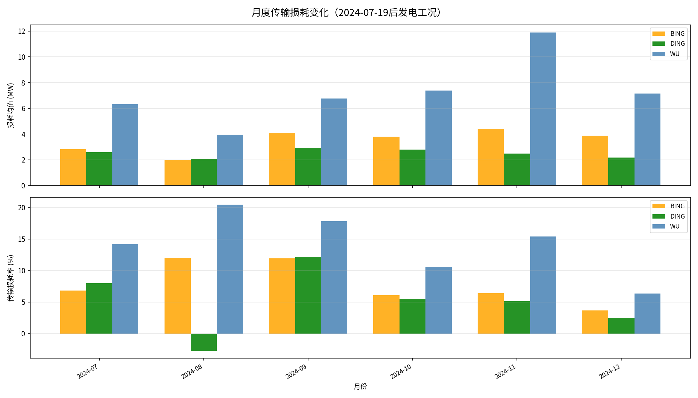

### 6.1 月度传输损耗数据（发电工况均值）

**BING 线路：**

| 月份 | 发电记录数 | 风机均值 (MW) | 损耗均值 (MW) | 损耗中位数 (MW) | 损耗率 |
|------|-----------|------------|------------|--------------|------|
| 2024-07 | 16,059 | 80.90 | 2.73 | 1.92 | 3.37% |
| 2024-08 | 26,646 | 34.71 | 1.75 | 1.70 | 5.05% |
| 2024-09 | 23,977 | 90.89 | 3.95 | 2.03 | 4.35% |
| 2024-10 | 40,425 | 110.40 | 3.72 | 2.70 | 3.37% |
| 2024-11 | 35,443 | 138.34 | 4.32 | 3.48 | 3.12% |
| 2024-12 | 28,575 | 131.14 | 3.84 | 3.06 | 2.93% |

**DING 线路：**

| 月份 | 发电记录数 | 风机均值 (MW) | 损耗均值 (MW) | 损耗中位数 (MW) | 损耗率 |
|------|-----------|------------|------------|--------------|------|
| 2024-07 | 15,947 | 86.54 | 2.52 | 2.16 | 2.91% |
| 2024-08 | 24,533 | 35.54 | 1.95 | 2.14 | 5.48% |
| 2024-09 | 22,799 | 88.70 | 2.83 | 2.18 | 3.19% |
| 2024-10 | 39,984 | 115.86 | 2.75 | 2.20 | 2.38% |
| 2024-11 | 35,017 | 123.80 | 2.47 | 2.10 | 1.99% |
| 2024-12 | 28,660 | 138.06 | 2.17 | 1.77 | 1.57% |

**WU 线路：**

| 月份 | 发电记录数 | 风机均值 (MW) | 损耗均值 (MW) | 损耗中位数 (MW) | 损耗率 |
|------|-----------|------------|------------|--------------|------|
| 2024-07 | 16,356 | 79.64 | 6.30 | 5.26 | 7.91% |
| 2024-08 | 28,537 | 29.94 | 3.88 | 3.64 | 12.94% |
| 2024-09 | 25,205 | 87.22 | 6.70 | 4.05 | 7.68% |
| 2024-10 | 41,280 | 117.23 | 7.35 | 5.67 | 6.27% |
| 2024-11 | 36,335 | 138.83 | 11.85 | 11.46 | 8.54% |
| 2024-12 | 28,228 | 136.87 | 7.14 | 6.05 | 5.22% |

### 6.2 月度规律解读

1. **8月损耗率最高（三条线路均如此）**：8月风机均值功率仅约 30 MW（低风速月），低功率时固定损耗占比更大，导致损耗率偏高。这与分功率区间分析中"低功率区间损耗率高"的结论一致。

2. **10月～12月损耗率趋于稳定**：随着风力增大、功率提升，损耗率在各线路均回归稳定水平（BING ~3%、DING ~2%、WU ~5～8%）。

3. **11月 WU 线路异常（损耗率 8.54%）**：11月 WU 损耗均值达 11.85 MW，远高于其他月份的 6～7 MW 水平。11月 WU 风机均值功率（138.83 MW）与 BING（138.34 MW）和 DING（123.80 MW）相近，但损耗却显著偏高。考虑到 WU 的正常损耗（含明阳自耗电）约为 7 MW，11月的 11.85 MW 额外偏高约 4.85 MW，需关注是否存在测量异常或线路设备故障。

4. **DING 线路损耗率持续下降趋势**（从 7月 2.91% 降至 12月 1.57%）：随功率提升，DING 的线路损耗率下降幅度最为明显，可能与 DING 线路的固定损耗占比更高有关（固定损耗/总功率随功率上升而下降）。

---

## 7 非发电状态分析（功率为负的记录）

### 7.1 非发电记录比例

| 线路 | 风机汇总≤0 记录数 | 占比 | 当时风机均值 (MW) | 当时线路测点均值 (MW) |
|------|----------------|-----|---------------|------------------|
| BING | 46,324 | 20.5% | -1.23 | -2.36 |
| DING | 47,066 | 20.8% | -0.56 | -2.07 |
| WU   | 37,283 | 16.5% | -0.92 | -2.52 |

### 7.2 负功率的物理含义

**风机汇总功率为负（Fan_sum ≤ 0）**：
- 说明该时刻该组风机的绝大多数处于待机/停机状态
- 停机的风机需要消耗少量厂用电（偏航控制、液压系统、变流器维持、照明等）
- 少量负功率（绝对值约 0.5～1.3 MW）是正常的维持性耗电

**集电线路测点功率为负（Line ≤ 0）**：
- 线路测点测到反向电流，对应电力从电网侧流向风机侧
- 其绝对值（约 2.1～2.5 MW）略大于风机侧负值
- 差值反映电缆和变压器本身在停机状态下的空载损耗

### 7.3 非发电状态传输损耗

当 Fan_sum < 0 时：

```
Fan_sum_S1 = -1 MW（风机耗电）
Line_meas  = -2 MW（线路测点，反向）
Loss = Fan - Line = -1 - (-2) = +1 MW
```

> 含义：即使在停机状态，**集电电缆和箱变的空载损耗约 1 MW**，这部分损耗由电网供给，不由风机发电覆盖。

---

## 8 核心结论与建议

### 8.1 结论汇总

#### 结论 1：全站功率分析调整

> 经风场风机主管确认：**全站功率由集电线路有功汇总计算得到**，实际上报时也是如此。
> ACTIVE_POWER_STATION 测点在 2024-03～06 整段时间缺失，因此不再作为独立分析对象。
> 本报告从当前版本起，**仅分析风机汇总功率 vs 集电线路测点功率**的关系。

#### 结论 2：S2 策略（负值置0）是正确的业务口径

- 风机不发电时消耗**厂用电（自耗电）**，厂用电由独立电源供给，与集电线路彼此独立
- 当风机有功为负时，对集电线路的实际贡献为 0，不应以负值参与汇总
- 因此 `FAN_ACTIVE_POWER_SUM_S2`（负值置0）是正确的风机功率汇总口径
- 全量数据中约 **13.2%** 的时刻存在风机厂用电消耗（Fan S1 < 0）

#### 结论 3：三条集电线路传输损耗差异（WU > BING > DING）已有明确解释

> **经风场主管确认**：差异的根本原因是**明阳风机 SCADA 有功包含风机内部自耗电**，
> 而东气/金风不含。WU 线路 100% 明阳风机，BING 约 34% 明阳，DING 完全无明阳。

| 线路 | 中高功率区间表观损耗率 | 扣除明阳自耗电后真实传输损耗（估算）|
|------|---------------------|--------------------------------|
| DING | **2.4%** | **~2.4%**（无明阳，直接为真实值）|
| BING | **2.8～3.3%** | **~2.4%** + BING 明阳自耗电（~1.0%×34%≈0.3%）|
| WU   | **5.6～8.8%** | **~2.4%** + WU 明阳自耗电（~1.7%）|

各线路的实际集电电缆传输损耗水平接近（约 2.4%），与 DING 线路实测值一致。
WU 和 BING 的额外"损耗"来自明阳风机 SCADA 的测量口径差异，并非电缆或测量仪器问题。

#### 结论 4：传输损耗的功率区间特征

- **低功率区间（0～30 MW）**：损耗率最高（10～25%），因固定损耗占比大 + 测量精度限制，此区间统计参考意义有限
- **中高功率区间（60 MW 以上）**：损耗率趋于稳定，是评估线路电阻性损耗水平的有效区间
- 损耗绝对值随功率增大，符合 $P_{loss} \propto I^2 R$ 物理规律

#### 结论 5：功率正负方向的正确理解

- 约 **13～17%** 的时刻风机处于净耗电状态（Fan S1 < 0）
- 非发电状态下停机耗电约 **0.5～1.3 MW/线路**（厂用电，来自独立电源）
- 集电线路功率同样可以为负（整体停机时反向潮流），约 **1 MW** 电缆空载损耗由电网供给
- 传输损耗分析应限于 Fan_S2 > 0 且 Line > 0 的发电工况，避免方向混淆

### 8.2 建议行动

| 优先级 | 建议 | 说明 |
|------|------|------|
| 🔴 高优 | **明确明阳风机 SCADA 有功口径** | 与明阳技术支持确认：MySE6.45-180 的 SCADA 有功是否确实包含风机内部自耗电（变频器/冷却/液压等），并获得自耗电的计算或校正方式 |
| 🔴 高优 | **建立分厂商的功率对比分析** | 计算风机功率时，对明阳风机采用"扣除内部自耗电"的修正口径，使三条线路可在同一口径下比较 |
| 🟠 中优 | **关注 11月 WU 损耗异常**  | 11月 WU 损耗均值 11.85 MW，考虑明阳自耗电后仍高于正常水平，需排查是否存在额外设备故障或测量异常 |
| 🟡 低优 | **建立月度损耗监控机制** | 基于修正口径（扣除明阳自耗电后）每月计算三线路实际传输损耗率，以 DING 线路的约 2.4% 作为基准参照 |

---

## 附录：图表索引

| 图号 | 文件名 | 内容 | 时段 |
|------|--------|------|------|
| 01 | `01_time_series.png` | **时间序列**：Fan vs Line（S2策略，全量）| 2024-03-15 起 |
| 02 | `02_scatter_plots.png` | **散点图**：Fan vs Line（S2策略）| 2024-03-15 起 |
| 03 | `03_diff_distribution.png` | **差值分布**：Fan - Line | 2024-03-15 起 |
| 04 | `04_diff_by_power_level.png` | **差值 vs 功率区间**（箱线图）| 2024-03-15 起 |
| 05 | `05_monthly_avg.png` | **月度均值**：Fan vs Line 及差值 | 2024-03-15 起 |
| 06 | `06_per_line_comparison.png` | **分线路**：风机汇总 vs 线路测点对比 | 2024-03-15 起 |
| 07 | `07_zero_fan_vs_line.png` | **厂用电独立性验证**：Fan<0 时 Line 的表现 | 2024-03-15 起 |
| 08 | `08_strategy_comparison.png` | **S1 vs S2 策略差异**（厂用电影响量化）| 2024-03-15 起 |
| 15 | `15_line_transmission_loss_comparison.png` | **三线路传输损耗分功率区间横向对比**（绝对值+损耗率）| 2024-07-19 后 |
| 16 | `16_fan_vs_line_scatter_per_line.png` | **各线路风机汇总 vs 线路测点散点图**（彩色编码损耗值）| 2024-07-19 后 |
| 17 | `17_monthly_loss_per_line.png` | **月度传输损耗变化**（绝对值+损耗率，三线路对比）| 2024-07-19 后 |
| 18 | `18_loss_distribution_per_line.png` | **各线路传输损耗分布直方图** | 2024-07-19 后 |
| 19 | `19_loss_rate_summary.png` | **三线路总体损耗率汇总柱状图** | 2024-07-19 后 |
| 20 | `20_fan_vs_line_quadrant.png` | **FAN_S1 vs LINE_S1 象限散点图**（全量+消耗区间放大）| 2024-07-19 后 |
| 21 | `21_consuming_mode_composition.png` | **消耗模式功率构成分解**（三线路：风机辅机+箱变铁损+电缆损耗）| 2024-07-19 后 |
| 22 | `22_whole_farm_power_balance.png` | **全场消耗状态功率平衡图**（电网供给的去向分解）| 2024-10 ～ 12 |
| 23 | `23_consuming_episode_timeseries.png` | **典型消耗状态时序图**（FAN/LINE 对比）| 单次事件 |
| 24 | `24_operational_state_distribution.png` | **运行状态分布饼图** + LINE_S1 分布（FAN<0 条件下）| 2024-07-19 后 |
| 25 | `25_fan_anomaly_type_distribution.png` | **风机异常类型分布**（三类通讯中断/卡值）| 全量 |
| 26 | `26_fan_zero_power_classification.png` | **零值卡值细分分类**（保留/删除/复核）| 全量 |
| 27 | `27_mass_event_timeline.png` | **第一类事件时间轴**（全场通讯中断）| 全量 |
| 28 | `28_line_repeat_analysis.png` | **集电线路连续重复分析** | 全量 |

所有图表文件：`DATA/峡阳B/analysis_output/`

---

## 补充分析：停机风机的厂用电来自哪里？

### 问题背景

在同一条集电线路上，当部分风机在发电、部分风机处于停机或维护状态时，停机风机的内部设备（偏航控制器、液压系统、变流器维持、照明等辅机）需要持续用电。这部分电力通常来自：

**可能方案 A**：来自同一集电线路上其他正在发电的风机（同线互供）  
**可能方案 B**：来自场站独立的厂用电/站用电系统（通过站用变从电网供电）

### 分析逻辑

利用集电线路和风机功率的符号和大小关系来判断电源来源：

```
测量点层级：

电网
  ↕ ← 全站功率（由集电线路汇总计算，非独立测点）
主变压器（35kV→220kV）
  ↕
35kV 主母线
  ├── 站用变 → 升压站辅助设备（控制室、照明等）
  ├── 集电线路 BING CT ← ACTIVE_POWER_BING（正=送出，负=受入）
  ├── 集电线路 DING CT ← ACTIVE_POWER_DING
  └── 集电线路 WU CT  ← ACTIVE_POWER_WU
          ↕
    箱式变压器（690V→35kV）
          ↕
    风机（风机 SCADA 测点）← FAN_SCADA（正=发电，负=耗电）
```

**判断准则**：
- 若停机风机用电来自**同线路其他风机**或**电网经集电线路传入** → 集电线路 CT 测量值应为**负值**（反向电流）
- 若停机风机用电来自**独立站用变** → 集电线路 CT 应保持**正值或零**（停机风机负荷不经过线路CT）

### 核心数据证据

#### 证据 1：FAN_S1 < 0 时，LINE_S1 几乎全部 < 0

| 条件 | 记录数 | 占比 |
|------|--------|------|
| FAN_S1 < 0（风机净耗电）| 39,124 | 100% |
| → LINE_S1 也 < 0（集电线路反向）| 30,572 | **78.1%** |
| → LINE_S1 ≈ 0（±0.5 MW 内）| 8,552 | 21.9% |
| → LINE_S1 > 0 | 0 | **0%** |

**结论**：在风机组合净耗电的所有时刻，集电线路测点要么也是负的（78.1%），要么接近于零（21.9%），**从不出现正值**。这直接证明：集电线路确实承载了停机风机的用电电流，电力从电网侧流向风机侧。

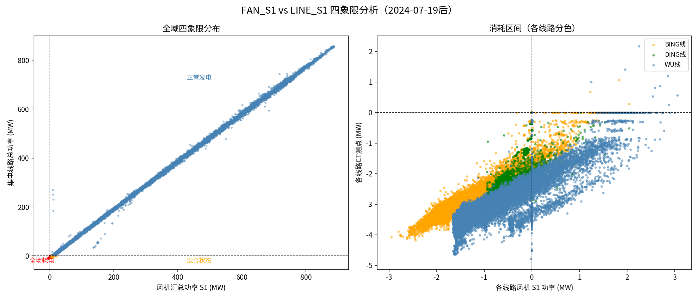

#### 证据 2：消耗状态运行状态分布

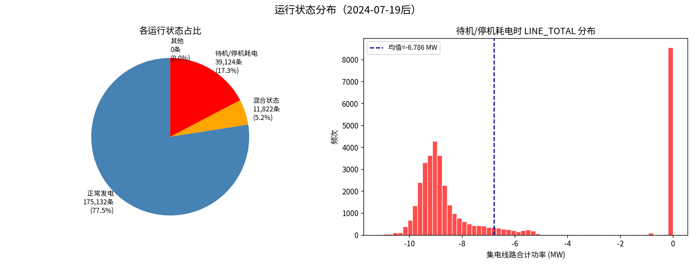

| 运行状态 | 记录数 | 占比 | 功率流向 |
|---------|--------|------|---------|
| 发电状态（FAN>0, LINE>0）| 175,133 | **77.5%** | 风机→电网 |
| 完全消耗（FAN<0, LINE<0）| 30,572 | **13.5%** | 电网→集电线路→风机 |
| 混合状态（FAN>0, LINE<0）| 11,788 | **5.2%** | 电网→集电线路（见下）|
| 其他 | 8,586 | 3.8% | - |

### 消耗状态的功率构成

当风机净耗电时（FAN_S1 < 0 且 LINE_S1 < 0），集电线路 CT 测量到的功率比风机 SCADA 汇总更大（绝对值更大），差值揭示了"隐藏"的损耗：

```
LINE_CT 测量 = 风机辅机耗电（SCADA 上报）+ 箱式变压器铁损 + 集电电缆损耗
```

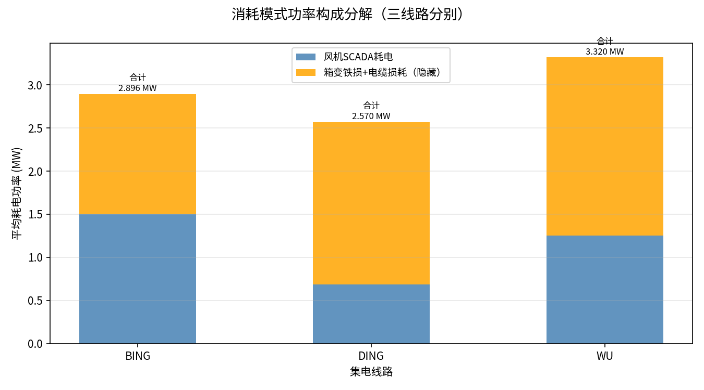

| 项目 | BING（47台）| DING（43台）| WU（47台）|
|------|-----------|-----------|---------|
| 风机 SCADA 上报耗电 | -1.50 MW | -0.69 MW | -1.25 MW |
| 箱变铁损 + 电缆损耗（隐藏）| -1.39 MW | -1.88 MW | -2.07 MW |
| **集电线路 CT 测量总计** | **-2.90 MW** | **-2.57 MW** | **-3.32 MW** |
| 折合每台风机箱变铁损 | ~30 kW/台 | ~44 kW/台 | ~44 kW/台 |

> **这个发现非常重要**：风机 SCADA 只测量风机终端功率（690V低压侧），**不包含箱式变压器的空载铁损**。即使风机完全停机，箱变仍保持励磁（约 30～44 kW/台），这部分损耗只能被集电线路 CT 捕捉到，而不在风机 SCADA 数据中显示。这也部分解释了之前分析中 WU 线路"传输损耗"偏高的现象。

### 全场消耗状态功率平衡

在全场完全消耗状态（2024年10～12月的有效数据，共 1,449 条，占 1.2%）：

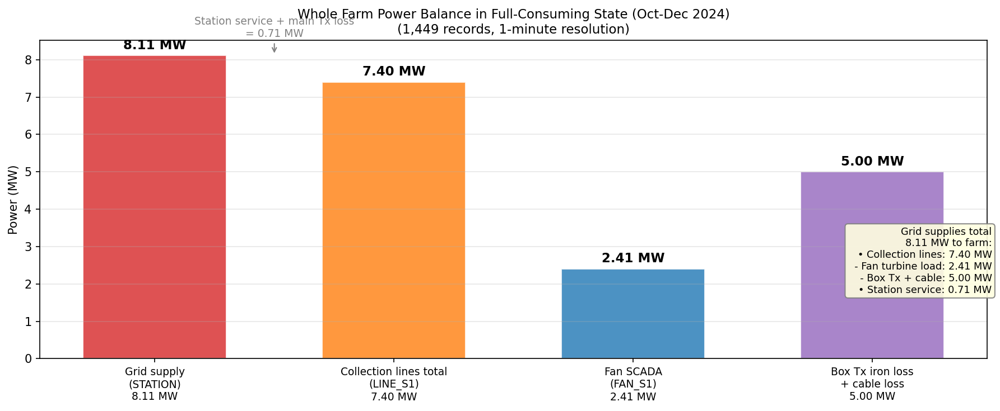

| 功率分量 | 数值 |
|---------|------|
| 电网向全场供电（STATION 绝对值）| **8.11 MW** |
| 三条集电线路总共取用（LINE 绝对值）| **7.40 MW** |
| 升压站站用电（LINE - STATION 差值）| **~0.71 MW** |
| 风机 SCADA 上报耗电 | **2.41 MW** |
| 箱变铁损 + 电缆损耗（LINE - FAN）| **~4.99 MW** |

典型的全场消耗时序（电网供电约 8 MW，风机 SCADA 仅报告约 2.4 MW，其余 5 MW 被箱变和电缆"悄悄"消耗）：

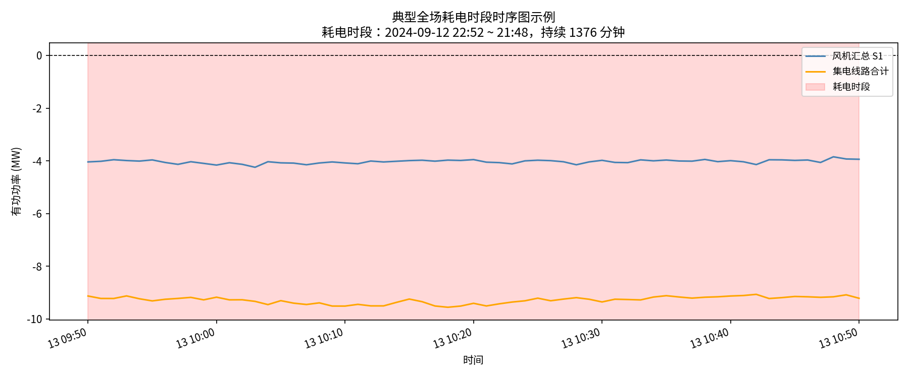

### 混合状态解释（FAN > 0，LINE < 0）

约 5.2% 的时刻出现"FAN_S1 > 0 但 LINE_S1 < 0"的混合状态，乍看矛盾，实则符合物理规律：

```
混合状态示例：
  FAN_S1 = +4 MW（部分风机发电，SCADA 净值为正）
  LINE_S1 = -4.6 MW（集电线路仍从电网受电！）

原因：
  ① 箱变空载铁损（约 44 kW × 137 台 = ~6 MW，不在 SCADA 中）
  ② SCADA 正值（4 MW）< 箱变铁损（~6 MW）
  ③ 因此集电线路 CT 看到的是反向净电流（电网 → 风机侧）
```

这是 **SCADA 测量盲区** 造成的表象，并非传感器故障。

### 结论

| 问题 | 结论 |
|------|------|
| 停机风机厂用电来自哪里？| **来自同一条集电线路**（电网经集电电缆供电）|
| 数据证据 | FAN<0 时 LINE_S1 有 78.1% 也为负，0% 为正 |
| 集电线路 CT 能否反映风机耗电？| **能**，但会额外包含箱变铁损（30～44 kW/台）|
| 站用电系统供的是哪部分？| 升压站控制室/通信/照明等辅助负荷（约 **0.7 MW**），不流经集电线路 CT |
| 风机 SCADA 厂用电数据完整吗？| **不完整**：只测量风机终端，遗漏箱变空载铁损（集电线路 CT 数据更准确）|
| WU 线路传输损耗偏高的追加解释 | 部分原因可能是 WU 线路箱变铁损计量配置与 BING/DING 不同 |

### 实践建议

1. **以集电线路 CT（LINE_S1）为准**评估各风机组的实际用电量，比风机 SCADA 汇总更准确
2. **箱变铁损不可忽视**：全场停机时箱变消耗约 **3～5 MW**，约占额定总功率（~900 MW）的 **0.3～0.5%**，若长期停机累积电量不可小觑
3. **WU 线路需进一步核查**：WU 的"传输损耗"偏高，需区分两部分：
   - 真实电缆阻抗损耗（$I^2 R$）
   - 箱变铁损测量配置差异
4. **全场停机时的电网受电监控**：建议在 SCADA/EMS 中增加"全场消耗功率"告警，若集电线路总功率 < -5 MW 持续超过 30 分钟，提示运维人员检查是否有不必要的设备维持励磁

---

*分析数据来源：峡阳B风电场 SCADA 系统*  
*分析脚本：`#7-2功率层级关系分析.py`*  
*分析时段：2024-03-15 00:00 ～ 2024-12-24 23:58（全量，407,519 条分钟级记录）*

---

## 第十一章：数据质量分析——连续时间相同数据的异常类型分类与清洗建议

### 问题背景

在利用单风机预测功率相加得到集电线路功率、再汇总得到全站功率的工作流中，数据质量是核心前提。当前风机 SCADA 数据存在**连续多个时间戳五元组（STATUS, ACTIVE_POWER, REACTIVE_POWER, WINDSPEED, WINDDIRECTION）完全相同**的现象，对其来源和处理方式的判断至关重要：

| 情形 | 判断 |
|------|------|
| **有功功率 ≠ 0** 且连续相同 | **确定异常**（卡值/数据冻结），删除 |
| **有功功率 = 0** 且连续相同 | **模糊情况**，需进一步分类（真实停机 or 通讯故障） |

### 三类异常定义

根据**同一分钟内同时开始重复的风机数量**，将异常分为三类：

| 类型 | 判断条件 | 物理含义 |
|------|---------|---------|
| **第一类**：全场通讯中断 | 同一分钟 ≥ 80 台风机同时开始重复 | 场站至 SCADA 的通讯链路整体断开 |
| **第二类**：部分通讯中断 | 同一分钟 5~79 台风机同时开始重复 | 集电线路级或网段级通讯故障 |
| **第三类**：单机异常 | < 5 台同时开始 | 单台风机或其通讯设备故障/维护/数据漂移 |

### 分类统计结果

基于 `联合重复值检测结果.xlsx`（16,258 条重复段），分类结果如下：

| 异常类型 | 段数 | 总记录数 | 清洗建议 |
|---------|------|--------|---------|
| 第一类-全场通讯中断 | 11,189 | 125,220 | **删除** |
| 第二类-部分通讯中断 | 1,442 | 329,514 | **删除** |
| 第三类-单机非零卡值 | 1,068 | 248,285 | **删除** |
| 第三类-单机通讯故障（零值）| 643 | 936,166 | **删除** |
| 第三类-发电状态零值 | 218 | 481,026 | **删除** |
| 正常停机-保留 | 1,438 | 181,969 | **保留** |
| 零值-状态待核实 | 260 | 26,167 | **人工复核** |
| **合计** | **16,258** | **2,328,347** | — |

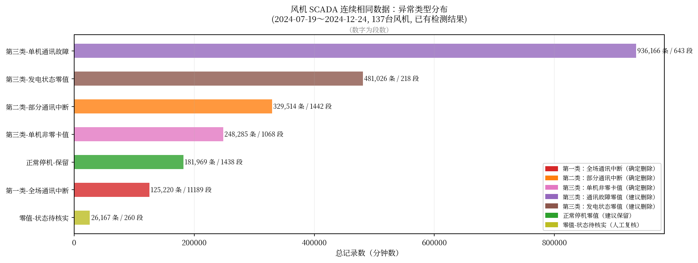

### 核心发现：第一类异常特征（全场通讯中断）

- 发现 **85 个时刻**有 ≥100 台风机同时在同一分钟开始重复
- **持续时长**：绝大多数为 **5~15 分钟**，是短时通讯中断特征
- **有功功率**：93% 的段为非零值（通讯断开时保持了当时的发电数据）
- **规律**：有时每隔 10 分钟出现一次（05:00, 05:09 等），疑与 SCADA 定时采集任务有关

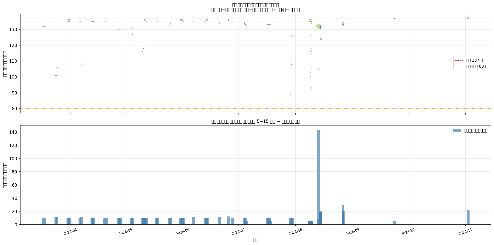

### 零值连续重复：真实停机 vs 数据冻结

这是本次分析的**核心难点**。有功=0 的连续重复可能是：

**情形 A（真实停机）**：
- 风机确实停机/检修/维护
- 状态码为合法停机码（如 明阳12=检修、13=维护，东气110=维护停机，金风2=停机状态）
- 持续时间与正常工单时长吻合
- → **建议保留**（本次识别 1,438 段，181,969 条）

**情形 B（数据冻结）**：
- 通讯中断时 SCADA 冻结上一时刻的数据（恰好上一时刻功率=0）
- 状态码为通讯故障码（明阳 STATUS=1/无通讯，东气 STATUS=113/通讯故障）
- 或状态码为"发电状态"但功率长期为 0（明阳 STATUS=6/并网不限电 + power=0，持续数天）
- → **建议删除**（本次识别 643+218=861 段，1,417,192 条）

**可操作的判别规则（供清洗脚本参考）**：

```python
# 非零值连续重复 → 直接删除
if active_power != 0:  # 任何非零连续重复
    → 删除

# 零值连续重复 → 按以下规则
elif active_power == 0:
    if 同时开始重复的风机数 >= 80:    # 第一类
        → 删除（全场通讯中断）
    elif 同时开始重复的风机数 >= 5:    # 第二类
        → 删除（部分通讯中断）
    elif STATUS in {明阳:1, 东气:113}: # 通讯故障码
        → 删除（单机通讯故障，数据冻结）
    elif STATUS in 发电状态码:          # 发电码 + 功率=0
        → 删除（异常：应发电却为零，疑似卡值）
    elif STATUS in 停机/维护/检修码:   # 合法停机码
        → 保留（真实停机，零值是正确的）
    else:
        → 人工复核
```

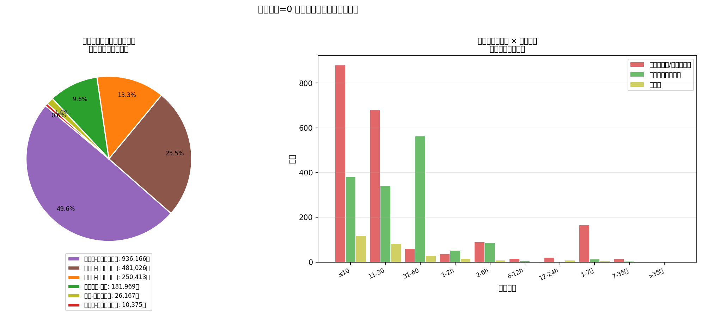

### 特殊情况：极长零值段

部分风机出现数天至数月的连续零值，需单独关注：

| 风机 | 状态码 | 持续时长 | 有功/风速 | 判断 |
|------|--------|---------|---------|------|
| #96 | 明阳 STATUS=6 (并网) | **165 天**（2024-03-15～08-27）| 均为 0 | 明显数据缺失，非真实 165 天停机 |
| #157/158 | 明阳 STATUS=6 | ~18 天 | 均为 0 | 长期数据缺失 |
| #156 | 明阳 STATUS=1 (无通讯) | ~18 天 | 均为 0 | 通讯失联，数据无效 |
| #84/100/106 | 明阳 STATUS=6 | ~8 天，且风速≠0 | 风速 3~4 m/s | 有风但功率为零，数据冻结 |

> **关键鉴别指标**：当 STATUS=6（并网不限电）且 ACTIVE_POWER=0 且 WINDSPEED ≠ 0 且持续时间 > 1 天 → **高度确定为数据冻结**，应删除。

### 集电线路连续重复分析

集电线路数据（BING/DING/WU 三条线路）也存在连续重复：

| 字段 | 非零卡值段数 | 非零记录数 | 零值段数 | 零值记录数 |
|------|-----------|---------|---------|---------|
| ACTIVE_POWER_BING | 11 | 104 | 535 | 13,069 |
| ACTIVE_POWER_DING | 10 | 87 | 94 | 9,137 |
| ACTIVE_POWER_WU | 10 | 87 | 542 | 14,318 |
| ACTIVE_POWER_STATION | 1（长期）| 180,647 | 7 | 8,457 |
| LIMIT_POWER | 443（正常）| 390,378 | — | — |

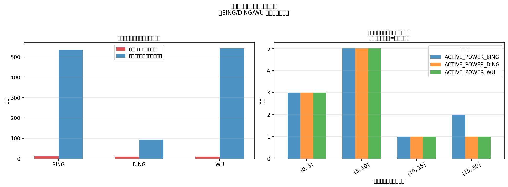

**集电线路清洗建议**：
- **非零卡值**（BING/DING/WU 各约 10 段）→ 确定删除，影响极小
- **零值段**：结合同时段风机数据判断；若对应时段风机也全部为零值卡值（第一/二类通讯中断），则集电线路的零值也是数据冻结，一并删除
- **ACTIVE_POWER_STATION**：180,647 条长期零值段（2024-03-15～07-18）为测点未投运，不纳入分析；后续建议使用集电线路有功代替全站功率
- **LIMIT_POWER**：390,378 条连续相同为正常现象（限电指令本身持续不变），**保留**

---

### 按集电线路的风机异常类型分布

在全场三类异常的整体分类基础上，按 BING/DING/WU 三条集电线路分别统计，揭示各线路的异常模式差异。

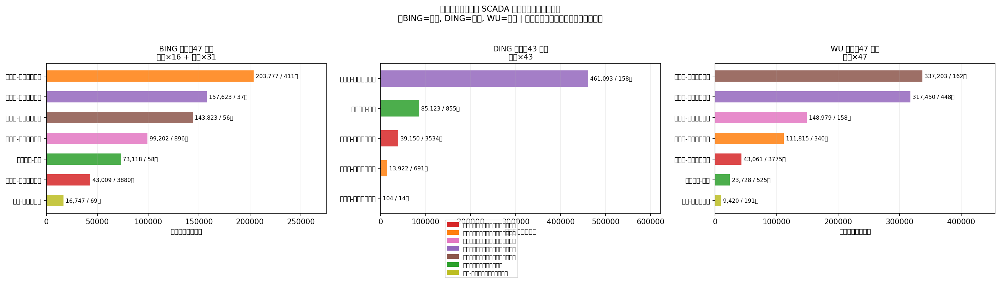

#### 分线路异常统计（全量风机 SCADA 数据）

| 集电线路 | 异常类型 | 段数 | 总记录数（条）| 清洗建议 |
|---------|---------|------|------------|---------|
| **BING** | 第二类-部分通讯中断 | 411 | **203,777** | 删除 |
| **BING** | 第三类-单机通讯故障 | 37  | 157,623 | 删除 |
| **BING** | 第三类-发电状态零值 | 56  | 143,823 | 删除 |
| **BING** | 第三类-单机非零卡值 | 896 | 99,202  | 删除 |
| **BING** | 正常停机-保留       | 58  | 73,118  | 保留 |
| **BING** | 第一类-全场通讯中断  | 3,880 | 43,009 | 删除 |
| **DING** | 第三类-单机通讯故障 | 158 | **461,093** | 删除 |
| **DING** | 正常停机-保留       | 855 | 85,123  | 保留 |
| **DING** | 第一类-全场通讯中断  | 3,534 | 39,150 | 删除 |
| **DING** | 第二类-部分通讯中断 | 691 | 13,922  | 删除 |
| **DING** | 第三类-单机非零卡值 | 14  | 104     | 删除 |
| **WU**  | 第三类-发电状态零值 | 162 | **337,203** | 删除 |
| **WU**  | 第三类-单机通讯故障 | 448 | 317,450 | 删除 |
| **WU**  | 第三类-单机非零卡值 | 158 | 148,979 | 删除 |
| **WU**  | 第二类-部分通讯中断 | 340 | 111,815 | 删除 |
| **WU**  | 第一类-全场通讯中断  | 3,775 | 43,061 | 删除 |
| **WU**  | 正常停机-保留       | 525 | 23,728  | 保留 |

**分线路清洗汇总（按集电线路）**：

| 线路 | 删除条数 | 保留条数 | 人工复核 |
|------|---------|---------|---------|
| **BING** | 647,434 | 73,118 | 16,747 |
| **DING** | 514,269 | 85,123 | 0      |
| **WU**   | 958,508 | 23,728 | 9,420  |

#### 关键差异解读

| 现象 | 数据证据 | 解释 |
|------|---------|------|
| **DING 单机通讯故障最多**（461,093 条）| 东气 DEW-D7000-184 有专用通讯故障码（STATUS=113），识别明确；其他厂商（尤其金风）无专用故障码 | 东气风机通讯故障码更完备，不代表实际故障频率更高 |
| **WU 需删除记录最多**（958,508 条）| 第三类-发电状态零值（337,203）+ 单机通讯故障（317,450）合计占 WU 总重复段的 65% | 明阳风机（WU 全部 47 台）STATUS=6 并网状态下有功长期为零的情况较多（详见极长零值段分析） |
| **BING 第二类异常最多**（203,777 条）| 411 段，远多于 WU（340 段）和 DING（691 段次/13,922 条）| BING 线路记录时长较长的部分通讯中断段，可能与 BING 的线路拓扑或通讯网段划分有关 |
| **DING 正常停机保留记录最多**（85,123 条）| 855 段，明显多于 BING（73,118/58 段）和 WU（23,728/525 段）| 东气风机停机码更丰富（多个合法停机状态码），更多零值段被正确识别为"真实停机"而非删除 |

---

### 异常期间风机功率之和与集电线路有功对比

在已确认异常发生时，通过对比各集电线路的**风机汇总功率（SCADA）**与**集电线路 CT 测点功率**，
发现两者在异常期间的行为存在重要差异。

#### 典型事件时序对比（第一类全场通讯中断）

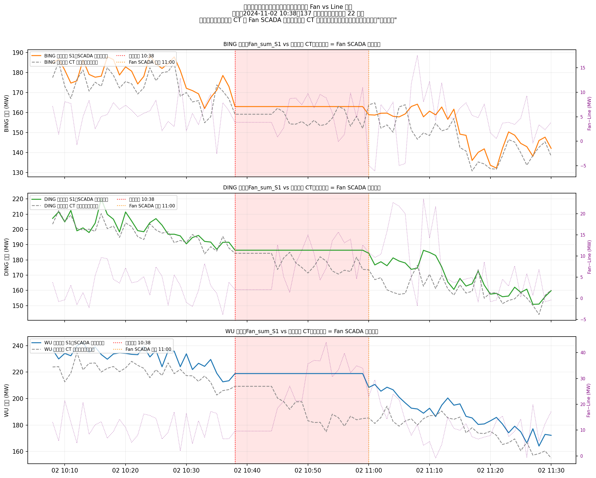

以 **2024-11-02 10:38** 的典型 Type1 事件（137 台同时冻结，持续约 22 分钟）为例，
数据揭示了通讯中断时两类测量值的不同行为：

```
时间           BING_SUM_S1    ACTIVE_POWER_BING    差值
10:38（正常）  162.99 MW      159.14 MW          +3.85 MW
10:39          162.99 MW      159.14 MW          +3.85 MW  ← 两者同步冻结
...（冻结中）...
10:44          162.99 MW      159.14 MW          +3.85 MW  ← 两者仍同步冻结
10:45          162.99 MW      162.16 MW          +0.83 MW  ← CT 已恢复实时！差值骤降
10:46          162.99 MW      160.29 MW          +2.71 MW
...
10:59          162.99 MW      152.07 MW          +10.92 MW ← Fan 仍冻结，差值虚高
11:00（恢复）  158.90 MW      163.85 MW          -4.95 MW  ← Fan SCADA 恢复
```

**关键发现：集电线路 CT 与风机 SCADA 同步冻结，但 CT 提前约 15 分钟恢复实时**

| 阶段 | 风机 SCADA 汇总 | 集电线路 CT | Fan - Line 差值 |
|------|--------------|-----------|--------------|
| 正常发电（异常前）| 实时更新 | 实时更新 | ~3.5 MW（正常传输损耗）|
| **冻结初期**（前 7 min）| ❄️ 冻结于 10:38 值 | ❄️ 同步冻结 | 保持正常差值 |
| **分裂期**（约 15 min）| ❄️ 仍冻结 | ✅ 已恢复实时 | **虚假偏移：最高达 ~11 MW**（虚高）或 ~0 MW（虚低）|
| 完全恢复 | ✅ 恢复 | ✅ 恢复 | 回归正常传输损耗 |

#### 异常时段与正常时段 Fan−Line 差值分布对比

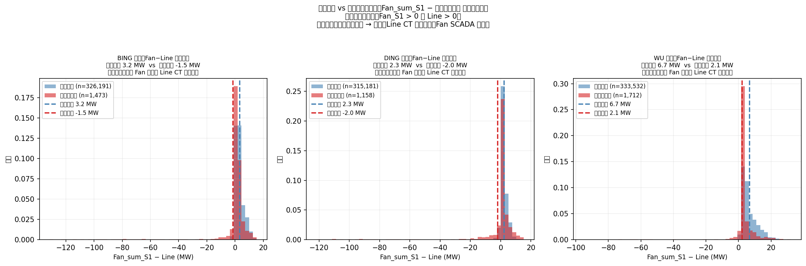

| 线路 | 正常时段 Fan−Line 均值 | Type1 异常时段 Fan−Line 均值 | 偏移 |
|------|---------------------|--------------------------|------|
| BING | ~3.5 MW             | 分布更宽、更分散              | 可正可负，主要来自 CT 先恢复后的"幻影差值" |
| DING | ~2.5 MW             | 分布更宽                   | 同上 |
| WU   | ~7.5 MW             | 分布更宽                   | 同上 |

#### 数据质量影响与清洗建议

> ⚠️ **重要结论**：在通讯中断期间，集电线路 CT（`ACTIVE_POWER_BING/DING/WU`）的**数据质量优于**风机 SCADA 汇总（`*_ACTIVE_POWER_SUM_S1`）：
> - CT 与 Fan SCADA 同步冻结，但 CT **更早恢复**实时测量（本例约提前 15 min）
> - 在 Fan SCADA 仍冻结、CT 已恢复的时段，若直接用 SCADA 汇总代替 CT，会引入显著误差
> - **建议**：在发现风机 SCADA 存在连续相同数据时，优先参考集电线路 CT 的实时数据，而非等待 Fan SCADA 恢复

**对 Fan−Line 传输损耗分析的影响**：
- 异常期间的 Fan−Line 差值不反映真实传输损耗，应在传输损耗统计时将 Type1/Type2 异常时段排除
- 已在第 5 章传输损耗分析中通过"仅分析发电工况（Fan_S2>0 且 Line>0）"部分过滤了异常影响，但建议进一步叠加异常时段标记进行更精确的清洗

**对数据清洗优先级的建议**：
1. 先清洗风机 SCADA 中的 Type1/Type2 事件（已确定数据冻结）
2. 对应时段的集电线路 CT 零值也一并标记（参考判断），但 **CT 非零值记录（异常恢复期）可保留**，因其反映了真实的实时功率
3. Type1 事件时段的集电线路 CT 值仅在冻结阶段无效，CT 恢复后的数据可信

---

### 数据清洗对风功率预测的影响

| 清洗内容 | 受影响记录数 | 占总记录比例 |
|---------|-----------|-----------|
| 风机非零卡值（确定删除）| 最多 248,285 × 137 台（按风机计）| 约 0.8% |
| 风机通讯故障零值（删除）| 936,166 条 | 含重复计算 |
| 全场/部分通讯中断（删除）| 125,220 + 329,514 条 | 约 2.0% |
| 正常停机（保留，零功率合理）| 181,969 条 | 0.6% |

> **清洗后预期效果**：删除约 2,120,211 条确定异常记录后，剩余数据中有功功率值的可靠性大幅提升，可用于：
> - 单风机功率预测模型训练（减少噪声输入）
> - 集电线路有功汇总（减少因卡值导致的功率突变）

### 分析脚本

完整分类与清洗建议脚本：`#7-4数据质量分析-连续相同异常类型分类与清洗建议.py`

输出文件：
- `#7-4分析结果/峡阳B/fan_repeat_classified.csv`：风机卡值分类明细（16,258 条）
- `#7-4分析结果/峡阳B/fan_repeat_cleaning_summary.csv`：按风机汇总清洗建议
- `#7-4分析结果/峡阳B/line_repeat_classified.csv`：集电线路卡值分类明细
- `#7-4分析结果/峡阳B/per_line_anomaly_breakdown.csv`：**分集电线路异常类型统计（新增）**

---

## 附录：图表索引（更新版）

| 图号 | 文件名 | 内容 | 时段 |
|------|--------|------|------|
| 15 | `15_line_transmission_loss_comparison.png` | **三线路传输损耗分功率区间横向对比** | 2024-07-19 后 |
| 16 | `16_fan_vs_line_scatter_per_line.png` | **各线路风机汇总 vs 线路测点散点图** | 2024-07-19 后 |
| 17 | `17_monthly_loss_per_line.png` | **月度传输损耗变化** | 2024-07-19 后 |
| 18 | `18_loss_distribution_per_line.png` | **各线路传输损耗分布直方图** | 2024-07-19 后 |
| 19 | `19_loss_rate_summary.png` | **三线路总体损耗率汇总柱状图** | 2024-07-19 后 |
| 20 | `20_fan_vs_line_quadrant.png` | **FAN_S1 vs LINE_S1 象限散点图** | 2024-07-19 后 |
| 21 | `21_consuming_mode_composition.png` | **消耗模式功率构成分解** | 2024-07-19 后 |
| 22 | `22_whole_farm_power_balance.png` | **全场消耗状态功率平衡图** | 2024-10 ～ 12 |
| 23 | `23_consuming_episode_timeseries.png` | **典型消耗状态时序图** | 单次事件 |
| 24 | `24_operational_state_distribution.png` | **运行状态分布饼图** | 2024-07-19 后 |
| 25 | `25_fan_anomaly_type_distribution.png` | **风机异常类型分布（三类×清洗建议）** | 全量 |
| 26 | `26_fan_zero_power_classification.png` | **零值卡值细分分类饼图+持续时长** | 全量 |
| 27 | `27_mass_event_timeline.png` | **第一类事件时间轴（全场通讯中断）** | 全量 |
| 28 | `28_line_repeat_analysis.png` | **集电线路连续重复分析** | 全量 |
| 29 | `29_per_line_anomaly_distribution.png` | **分集电线路风机异常类型分布（BING/DING/WU）** | 全量 |
| 30a | `30a_anomaly_fan_vs_line_timeseries.png` | **典型 Type1 异常事件前后 Fan vs Line 时序（三线路）** | 典型事件 |
| 30b | `30b_anomaly_vs_normal_diff_distribution.png` | **正常 vs 异常时段 Fan−Line 差值分布对比** | 全量 |

所有图表文件：`DATA/峡阳B/analysis_output/`

---

*分析数据来源：峡阳B风电场 SCADA 系统*  
*分析脚本：`#7-2功率层级关系分析.py`、`#7-4数据质量分析-连续相同异常类型分类与清洗建议.py`*  
*分析时段：2024-03-15 00:00 ～ 2024-12-24 23:58（全量，共 407,519 条分钟级记录）*  
*注：全站功率（ACTIVE_POWER_STATION）已废弃，全站功率由集电线路有功汇总计算*
