# 风机功率、集电线路功率与全站功率层级关系分析报告

**场站：峡阳B（Xia Yang B）**  
**数据时段：2024-03-15 ～ 2024-12-24**  
**数据总量：407,519 条（分钟级 SCADA 记录）**  
**报告生成脚本：`#7-2功率层级关系分析.py`**

---

## 目录

1. [背景与目标](#1-背景与目标)
2. [数据概览](#2-数据概览)
3. [三层功率体系说明](#3-三层功率体系说明)
4. [汇总统计与基本描述](#4-汇总统计与基本描述)
5. [风机功率 vs 集电线路功率（Fan − Line）](#5-风机功率-vs-集电线路功率fan--line)
6. [集电线路功率 vs 全站功率（Line − Station）](#6-集电线路功率-vs-全站功率line--station)
7. [风机功率 vs 全站功率（Fan − Station）](#7-风机功率-vs-全站功率fan--station)
8. [全站功率数据质量专题分析](#8-全站功率数据质量专题分析)
9. [分集电线路精细分析（BING / DING / WU）](#9-分集电线路精细分析bing--ding--wu)
10. [统计策略对比（S1 vs S2）](#10-统计策略对比s1-vs-s2)
11. [时间维度分析（月度 / 小时）](#11-时间维度分析月度--小时)
12. [差异原因分析](#12-差异原因分析)
13. [核心结论与建议](#13-核心结论与建议)

---

## 1 背景与目标

风电场 SCADA 系统对同一时刻的发电功率，存在三个不同层级的计量点：

```
风机有功（Turbine-level）
        ↓  集电线缆 + 箱变 损耗
集电线路有功（Collection Line-level）
        ↓  集电系统损耗 + 场用电 + 主变损耗
全站有功（Station-level）
```

三个层级功率**在物理上不应相等**，其差值反映了：
- 测量位置差异
- 线路和变压器的电能损耗
- 场站厂用电消耗
- 计量设备精度与时间同步问题

本报告对峡阳B（含 BING、DING、WU 三条集电线路，共约 137 台风机）的 SCADA 数据进行深度分析，量化上述差异并探讨其成因。

---

## 2 数据概览

### 2.1 字段说明

| 字段名 | 含义 | 单位 |
|--------|------|------|
| `timestamp` | 时间戳（分钟级） | — |
| `ACTIVE_POWER_BING` | 集电线路 BING 测点有功 | MW |
| `ACTIVE_POWER_DING` | 集电线路 DING 测点有功 | MW |
| `ACTIVE_POWER_WU` | 集电线路 WU 测点有功 | MW |
| `ACTIVE_POWER_STATION` | 全站有功（并网点测点） | MW |
| `LIMIT_POWER` | 限电目标值（>0 时表示受限） | MW |
| `FAN_ACTIVE_POWER_SUM_S1` | 所有风机有功之和（含负值） | MW |
| `FAN_ACTIVE_POWER_SUM_S2` | 所有风机有功之和（负值置0） | MW |
| `LINE_ACTIVE_POWER_SUM_S1` | 集电线路测点之和（含负值） | MW |
| `LINE_ACTIVE_POWER_SUM_S2` | 集电线路测点之和（负值置0） | MW |
| `BING/DING/WU_ACTIVE_POWER_SUM_S1/S2` | 各线路所含风机有功汇总 | MW |

### 2.2 风机归属（线路-风机编号映射）

| 集电线路 | 风机编号范围 | 台数 |
|----------|-------------|------|
| BING | 153 ～ 199 号 | 47 台 |
| DING | 110 ～ 152 号 | 43 台 |
| WU   | 63 ～ 109 号  | 47 台 |

> 全场共 137 台风机（63 号 ～ 199 号）。

### 2.3 数据完整性

- **时间覆盖率**：2024-03-15 00:00 ～ 2024-12-24 23:58，共约 285 天
- **理论分钟数**：≈285 × 1440 = 410,400 分钟
- **实际记录数**：407,519 条（覆盖率约 99.3%，数据完整性良好）
- **缺失值**：所有关键列（FAN/LINE/STATION）均无 NaN

---

## 3 三层功率体系说明

### 3.1 S1 / S2 策略定义

由于风机在低风速、停机或故障时可能出现负功率（逆变器吸收电网无功或测量噪声），脚本提供两种策略：

| 策略 | 处理方式 | 代表场景 |
|------|---------|---------|
| **S1**（含负值） | 所有值保留，直接求和 | 研究真实电气状态，包含反向潮流 |
| **S2**（负值置0） | 负值剪切为 0 后求和 | 运营统计口径，更接近实际发电量 |

> 本报告以 **S2 策略**为主要分析口径，需要时同时引用 S1。

### 3.2 分析变量定义

```
FAN     = FAN_ACTIVE_POWER_SUM_S2    （全场风机汇总，S2）
LINE    = LINE_ACTIVE_POWER_SUM_S2   （全场集电线路汇总，S2）
STATION = ACTIVE_POWER_STATION       （全站并网点功率）

DIFF_FAN_LINE    = FAN - LINE
DIFF_LINE_STATION = LINE - STATION
DIFF_FAN_STATION  = FAN - STATION
```

---

## 4 汇总统计与基本描述

### 4.1 三层功率描述性统计（全量数据，407,519 条）

| 统计量 | FAN (MW) | LINE (MW) | STATION (MW) |
|--------|----------|-----------|--------------|
| 均值   | **213.46** | **202.96** | **122.73** |
| 标准差 | 233.83 | 227.26 | 216.71 |
| 最小值 | 0.00 | 0.00 | -11.90 |
| P5     | 0.00 | 0.00 | -9.52 |
| P25    | 24.27 | 15.43 | 0.00 |
| P50（中位数）| 125.38 | 116.95 | **0.00** |
| P75    | 329.05 | 316.64 | 155.20 |
| P95    | 734.45 | 706.07 | 666.38 |
| P99    | 840.90 | 809.67 | 800.70 |
| 最大值 | 893.45 | 858.76 | 852.67 |

> ⚠️ **STATION 中位数为 0.00**，揭示超过一半的时间段内全站功率测点读数为零或负数，这是一个严重的数据质量问题（详见第 8 节）。

### 4.2 差值描述性统计（全量数据）

| 统计量 | Fan−Line (MW) | Line−Station (MW) | Fan−Station (MW) |
|--------|---------------|-------------------|------------------|
| 均值   | **10.50** | **80.23** | **90.73** |
| 标准差 | 8.94 | 153.55 | 156.18 |
| 最小值 | -453.91 | -51.37 | -452.31 |
| P1     | 0.00 | -1.06 | 0.00 |
| P25    | 6.22 | 1.11 | 9.56 |
| P50（中位数） | 8.47 | 5.64 | 17.61 |
| P75    | 13.50 | 88.86 | 97.11 |
| P95    | 28.92 | 436.26 | 450.30 |
| P99    | 35.08 | 721.56 | 747.84 |
| 最大值 | 189.82 | 845.36 | 880.70 |

> Line−Station 和 Fan−Station 的超大均值（80 MW / 90 MW）以及 P75 差距（89/97 MW vs 中位数仅 5.6/17.6 MW）揭示了分布的严重偏斜——主因是大量 STATION=0 的异常记录拉高了均值。

### 4.3 三层功率相关性

**全量数据（407,519 条）：**

|  | FAN | LINE | STATION |
|--|-----|------|---------|
| FAN | 1.000 | **0.9997** | 0.762 |
| LINE | 0.9997 | 1.000 | 0.762 |
| STATION | 0.762 | 0.762 | 1.000 |

**仅保留 STATION>0 的记录（175,028 条）：**

|  | FAN | LINE | STATION |
|--|-----|------|---------|
| FAN | 1.000 | **0.9995** | **0.9995** |
| LINE | 0.9995 | 1.000 | **0.9998** |
| STATION | 0.9995 | 0.9998 | 1.000 |

> **关键发现**：排除 STATION=0/负值的异常记录后，三层功率之间的相关系数高达 **0.9995～0.9998**，接近完美线性相关。全量数据中 STATION 相关性仅 0.76，完全是数据质量问题所致，而非真实的物理解耦。

---

## 5 风机功率 vs 集电线路功率（Fan − Line）

### 5.1 总体特征

Fan − Line 差值分布较为集中，体现了一种**稳定的、随功率水平正相关的系统性偏差**：

| 统计量 | 值 (MW) |
|--------|---------|
| 均值   | 10.50 |
| 中位数 | 8.47 |
| 标准差 | 8.94 |
| P5 ～ P95 | 0.00 ～ 28.92 |
| 正值占比 | >95% |

**当 FAN > 50 MW 时（正常发电工况，274,041 条）：**

| 统计量 | 值 (MW) |
|--------|---------|
| 均值   | **13.25** |
| 中位数 | 10.34 |
| 标准差 | 8.38 |
| P5 ～ P95 | 5.10 ～ 30.88 |

> 正常发电工况下，风机汇总功率平均比集电线路测点高出约 **13 MW**（约占 FAN 均值的 6.2%）。

### 5.2 差值随功率水平的变化

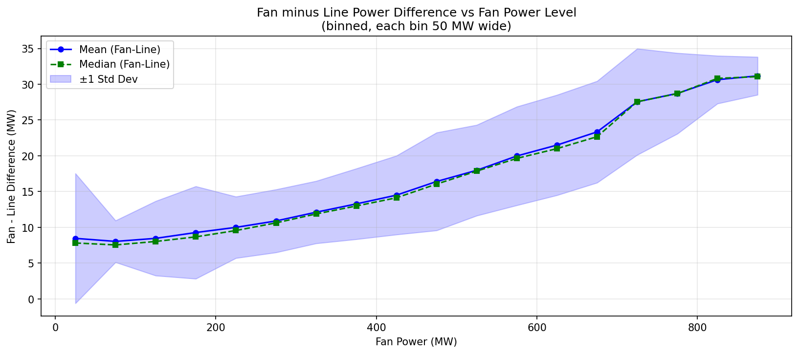

| 风机功率区间 (MW) | 样本量 | Fan−Line 均值 (MW) | Fan−Line 标准差 (MW) |
|-----------------|--------|-------------------|---------------------|
| 0 ～ 50   | 115,673 | 5.60  | 7.49 |
| 50 ～ 100 | 49,212  | 8.04  | 2.91 |
| 100 ～ 200| 70,938  | 8.82  | 5.80 |
| 200 ～ 300| 42,572  | 10.40 | 4.37 |
| 300 ～ 400| 29,298  | 12.64 | 4.66 |
| 400 ～ 500| 21,544  | 15.34 | 6.20 |
| 500 ～ 600| 17,902  | 18.94 | 6.69 |
| 600 ～ 700| 17,601  | 22.41 | 7.12 |
| 700 ～ 800| 12,995  | 28.11 | 6.66 |
| 800 ～ 900| 11,979  | 30.74 | 3.23 |

**规律**：Fan−Line 差值随功率升高呈单调递增趋势，从低功率段约 5.6 MW 增加到高功率段约 30.7 MW。这与以下物理机制一致：
- **线路电阻损耗**与电流的平方成正比（$P_{loss} = I^2 R$）；电流随功率增大而升高，故损耗随功率近似平方增加。
- 高功率时更多风机并网、更长集电支路带电，总阻抗更大。

### 5.3 可视化

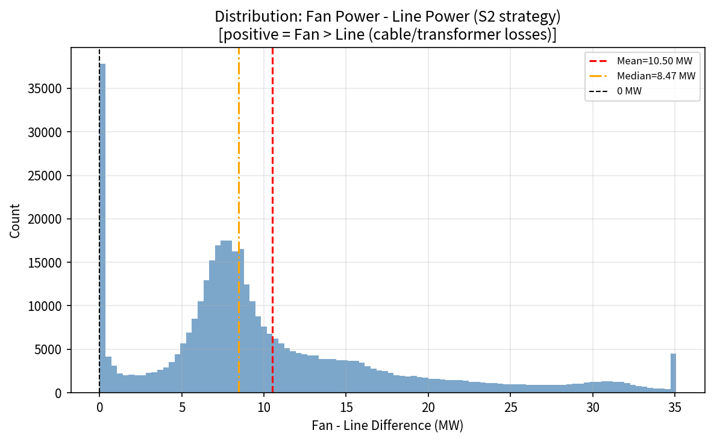

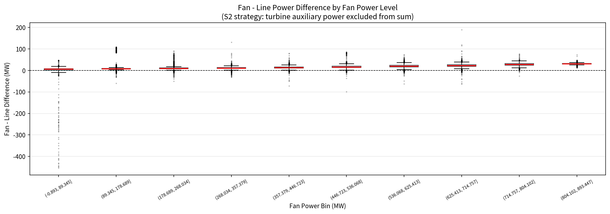

---

## 6 集电线路功率 vs 全站功率（Line − Station）

### 6.1 有效数据子集（STATION > 0）

由于全量数据中 57% 的 STATION 记录为零或负值（数据质量问题），本节单独分析 **STATION > 0** 的有效子集（175,028 条，占 43%）。

**有效子集统计：**

| 统计量 | FAN (MW) | LINE (MW) | STATION (MW) | Line−Station (MW) |
|--------|----------|-----------|--------------|-------------------|
| 均值   | 303.38 | 289.76 | 287.75 | **2.01** |
| 中位数 | 220.37 | 210.42 | 209.31 | **1.41** |
| 标准差 | 256.52 | 249.67 | 248.18 | 2.21 |
| P5     | 18.80  | 9.42   | 8.41   | -0.50 |
| P95    | 805.92 | 776.89 | 771.12 | 6.43 |

> **核心结论**：在 STATION 测点正常工作时，Line 与 Station 的功率差值均值仅约 **2.0 MW**（中位数 1.4 MW），标准差 2.21 MW。这是一个非常小且稳定的差值，物理上对应**场用电**（auxiliary consumption）和主变低压侧与高压侧计量点之间的微小差异。

### 6.2 分布特征

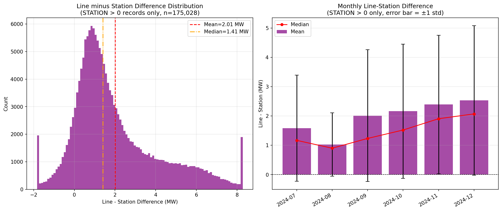

- 差值基本服从以约 1.5 MW 为中心的正态分布
- P5 = -0.50 MW（极少数情况 STATION 略高于 LINE，可能是测量误差或无功补偿设备并入）
- P95 = 6.43 MW（高功率段厂用电上升）

### 6.3 LINE/STATION 功率比值（STATION > 0）

| 统计量 | LINE/STATION 比值 |
|--------|-----------------|
| 中位数 | 1.0074 |
| P25    | 1.0038 |
| P75    | 1.0133 |
| P95    | 1.1054 |

> LINE/STATION 比值中位数为 **1.0074**，即集电线路功率汇总比全站并网点约高出 **0.74%**，反映厂用电占比。

### 6.4 散点图（STATION > 0 有效记录）

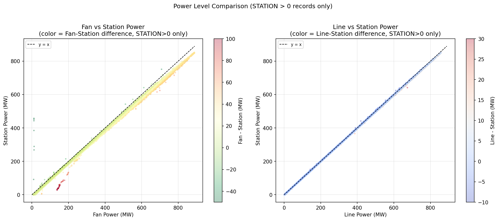

右图（LINE vs STATION）中散点几乎完全落在 y=x 参考线上，定量证明集电线路与全站功率之间的极高线性关系（r=0.9998）。颜色（Line-Station 差值）呈现出随功率升高而略微加深的趋势，对应厂用电在高功率段的绝对值略有增加。

---

## 7 风机功率 vs 全站功率（Fan − Station）

### 7.1 有效数据子集（STATION > 0）

| 统计量 | Fan−Station 差值 (MW) |
|--------|-----------------------|
| 均值   | **15.62** |
| 中位数 | 11.22 |
| 标准差 | 11.44 |
| P5     | 6.40 |
| P95    | 37.20 |

Fan − Station = (Fan − Line) + (Line − Station) = **集电线路损耗** + **厂用电**

- 集电线路损耗（Fan−Line）均值：13.25 MW（正常发电工况）
- 厂用电（Line−Station）均值：2.01 MW
- Fan−Station 合计：**≈15.3 MW**（与实测均值 15.62 MW 吻合）

### 7.2 散点图


左图（FAN vs STATION）中散点整体在 y=x 线右侧，表明 FAN 系统性偏高。颜色越深（差值越大）的点集中在高功率区，与线路损耗随功率增大的物理规律一致。

---

## 8 全站功率数据质量专题分析

### 8.1 异常规模

| 状态 | 记录数 | 占比 |
|------|--------|------|
| STATION > 0（正常） | 175,028 | **42.95%** |
| STATION = 0 | 189,086 | **46.40%** |
| STATION < 0 | 43,405 | **10.65%** |
| **合计异常** | **232,491** | **57.05%** |

> **超过半数的 STATION 记录存在异常**，这是本报告最重要的发现之一。

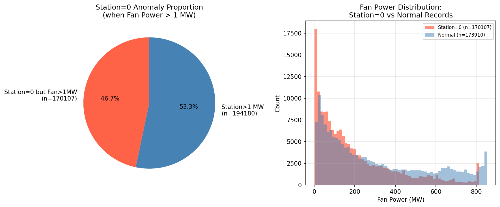

### 8.2 月度异常分布

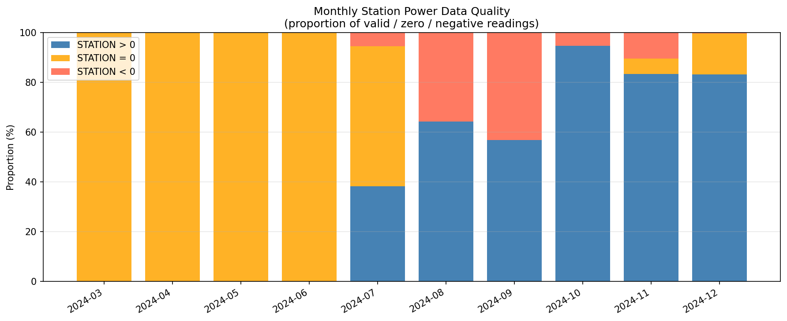

| 月份 | 记录数 | STATION>0 | STATION=0 | STATION<0 |
|------|--------|-----------|-----------|-----------|
| 2024-03 | 24,480 | **0.0%** | **100.0%** | 0.0% |
| 2024-04 | 43,200 | **0.0%** | **100.0%** | 0.0% |
| 2024-05 | 44,640 | **0.0%** | **100.0%** | 0.0% |
| 2024-06 | 43,200 | **0.0%** | **100.0%** | 0.0% |
| 2024-07 | 44,640 | 38.3% | 56.3% | **5.4%** |
| 2024-08 | 43,200 | 64.2% | 0.0% | **35.7%** |
| 2024-09 | 43,200 | 56.8% | 0.0% | **43.2%** |
| 2024-10 | 43,200 | **94.6%** | 0.0% | 5.4% |
| 2024-11 | 43,200 | 83.4% | 6.2% | 10.4% |
| 2024-12 | 34,559 | 83.1% | 16.6% | 0.3% |

**月度分析揭示三个阶段：**

#### 阶段 1：3月～6月（完全缺失）
- STATION 全量为 0，持续 **4 个月**
- 同期 FAN 均值 148～207 MW，风机正常发电
- **结论：全站功率测点未投运或 SCADA 采集链路中断**

#### 阶段 2：7月～9月（恢复期，伴随大量负值）
- 7月：开始出现正值读数（38.3%），但仍有大量零值（56.3%）和负值（5.4%）
- 8月：零值消失，但负值急剧上升至 35.7%（14,939 条）
- 9月：负值比例进一步升至 43.2%（18,650 条）
- 负值区间：[-11.90, 0)，STATION < 0 时 STATION 均值约 **-8.10 MW**
- **结论：计量互感器极性接反，或测量接线错误导致反号**

#### 阶段 3：10月～12月（基本正常）
- 10月后 STATION 正常比例升至 83～95%，数据质量大幅改善
- 残余零值（11月 6.2%、12月 16.6%）可能对应停机检修时段

### 8.3 STATION=0 时风机仍在发电

| 场景 | 记录数 | 占比 |
|------|--------|------|
| STATION=0 且 FAN>1 MW | 170,107 | **41.74%** |
| STATION=0 且 FAN>100 MW | 100,544 | **24.67%** |

> 有 10 万余条记录中，风机发电量超过 100 MW 但全站功率显示为 0，均为数据质量问题，**不能**用于准确的三层功率差值分析。

### 8.4 限电状态与 STATION 异常的交叉分析

| 是否限电（LIMIT_POWER > 0） | 记录数 | FAN 均值 | LINE 均值 | STATION 均值 | Line−Station 均值 |
|---------------------------|--------|----------|-----------|--------------|-------------------|
| 未限电（False） | 187,990 | 179.67 MW | 170.14 MW | **-0.001 MW** | 170.14 MW |
| 限电中（True）  | 219,529 | 242.40 MW | 231.06 MW | **227.82 MW** | **3.24 MW** |

**关键发现**：
- 未限电时，STATION 均值接近 0，证明未限电时段基本与阶段 1（3月～6月）重叠——那段时间恰好也没有限电指令。
- 限电时段（7月以后）STATION 测点才逐渐恢复正常，Line−Station 均值回归正常的 3.24 MW。

---

## 9 分集电线路精细分析（BING / DING / WU）

### 9.1 各线路功率汇总

| 集电线路 | 台数 | 线路测点均值 (MW) | 对应风机汇总均值 (MW) | 差值均值 (MW) | 差值中位数 (MW) | 差值标准差 (MW) |
|----------|------|----------------|---------------------|-------------|----------------|----------------|
| **BING** | 47 台 | 70.28 | 73.47 | **3.19** | 2.70 | 2.91 |
| **DING** | 43 台 | 65.82 | 68.20 | **2.38** | 2.29 | 2.13 |
| **WU**   | 47 台 | 65.63 | 71.79 | **6.17** | 4.28 | 4.83 |

### 9.2 关键观察

1. **WU 线路差值最大（6.17 MW）**，约为 BING 的 2 倍、DING 的 2.6 倍。
   - WU 线路包含 63～109 号风机（共 47 台），与 BING 台数相同，但差值更大。
   - 可能原因：WU 线路电缆更长、导线截面积更小，或箱变容量配置差异，导致更高的集电线路损耗。
   - 也不排除 WU 线路测点的量程或倍率系数配置有误。

2. **DING 线路差值最小（2.38 MW）**，43 台风机，差值/台数比最优。

3. **各线路均表现出 FAN > LINE（差值均为正）**，符合物理逻辑（风机侧量总功率 > 线路测点）。

### 9.3 散点图与分布

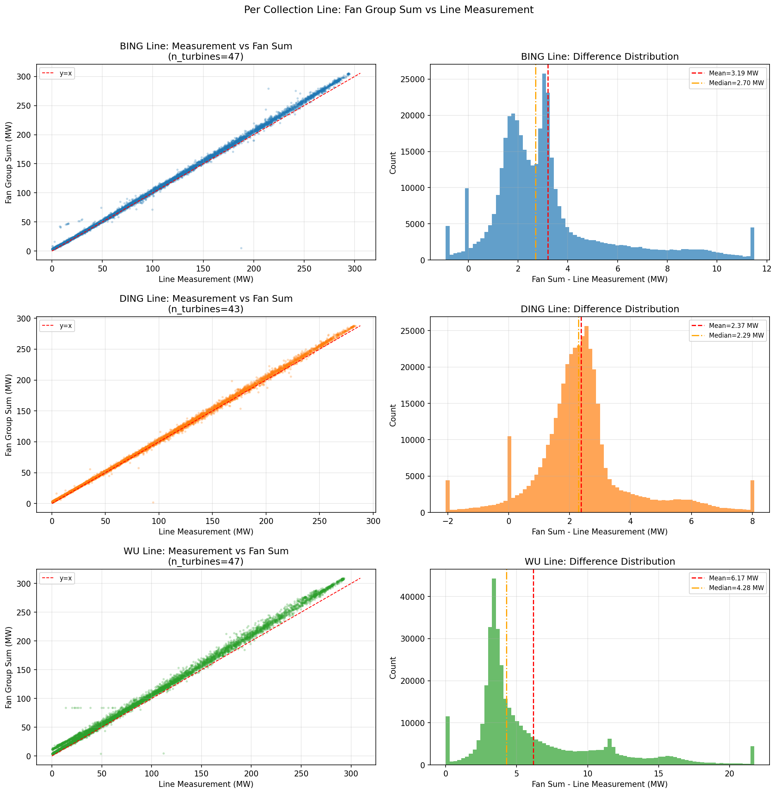

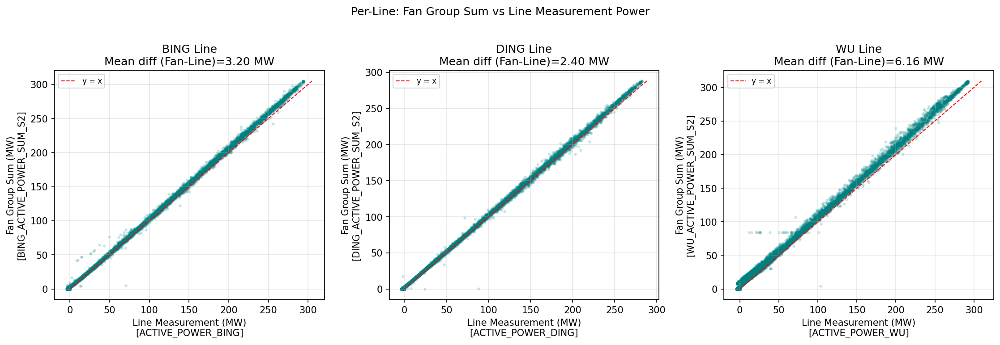

- 散点图中，WU 线路的点明显偏离 y=x 线（风机汇总系统高于线路测点），斜率约为 1.09。
- BING 和 DING 线路散点几乎紧贴 y=x，差值标准差更小，数据一致性更好。

### 9.4 线路测点负值分析

| 线路 | 测点负值记录数 | 占比 |
|------|--------------|------|
| BING | 63,772 | 15.65% |
| DING | 78,094 | 19.17% |
| WU   | 56,368 | 13.83% |

> 各线路测点均出现大量负值（13～19%），同样与全站功率 STATION 的负值问题相关——推断是 7月～9月计量极性错误阶段，集电线路测点也受同一计量系统影响而出现负号。使用 S2 策略将负值置 0 可规避此影响。

---

## 10 统计策略对比（S1 vs S2）

### 10.1 策略差异量化

| 策略差异 | 非零记录数 | 均值（S2-S1）(MW) | 最大差值 (MW) |
|---------|-----------|-------------------|--------------|
| FAN（S2 - S1） | 365,503（89.7%） | +0.82 | +5.22 |
| LINE（S2 - S1）| 80,581（19.8%） | +1.23 | +11.17 |

**含义**：
- **FAN 差异**：89.7% 的时刻存在至少一台风机有功为负（逆变器轻微吸收），S2 将这些负值置 0 后，FAN_S2 平均比 FAN_S1 高约 0.82 MW。
- **LINE 差异**：19.8% 的时刻集电线路测点为负，主要集中在 7月～9月计量极性错误阶段。S2 置 0 后，LINE_S2 平均高于 LINE_S1 约 1.23 MW。

### 10.2 策略选择建议

| 用途 | 推荐策略 | 理由 |
|------|---------|------|
| 发电量电量统计 | **S2** | 负功率不计入发电量，符合计量规范 |
| 电气状态研究 | **S1** | 反映真实潮流，包含反向功率信息 |
| 差异分析（本报告）| **S2** | 排除负值噪声干扰，差值含义更清晰 |
| 日均/月均功率计算 | **S2** | 避免低谷负值拉低统计均值 |

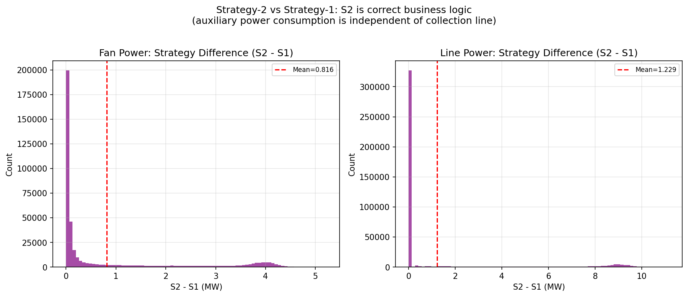

---

## 11 时间维度分析（月度 / 小时）

### 11.1 月度趋势

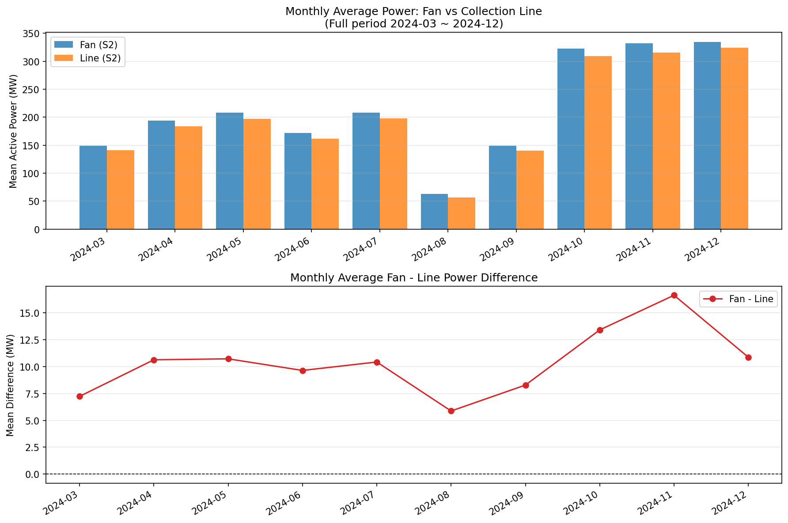

| 月份 | FAN 均值 (MW) | LINE 均值 (MW) | STATION 均值 (MW) | Fan−Line (MW) | Line−Station (MW) |
|------|-------------|---------------|------------------|-------------|------------------|
| 2024-03 | 148.5 | 141.3 | 0.0* | 7.2 | 141.3* |
| 2024-04 | 194.0 | 183.4 | 0.0* | 10.6 | 183.4* |
| 2024-05 | 207.9 | 197.1 | 0.0* | 10.7 | 197.1* |
| 2024-06 | 171.5 | 161.9 | 0.0* | 9.6 | 161.9* |
| 2024-07 | 208.4 | 198.0 | 89.2 | 10.4 | 108.8 |
| 2024-08 | 62.5  | 56.6  | 53.1 | 5.9  | 3.6 |
| 2024-09 | 148.8 | 140.6 | 135.5 | 8.3 | 5.0 |
| 2024-10 | 322.9 | 309.5 | 307.1 | 13.4 | 2.4 |
| 2024-11 | 331.7 | 315.1 | 312.3 | 16.6 | 2.8 |
| 2024-12 | 334.8 | 323.9 | 321.8 | 10.9 | 2.1 |

> *标注为 STATION 测点不可用月份（测量值全为 0，不反映真实功率）

**月度观察：**
1. **2024 年秋冬季（10～12月）功率最高**：FAN 均值约 320～335 MW，约为夏季（8月）的 5 倍。
2. **Fan−Line 差值随季节波动**：低功率月（8月 5.9 MW）< 高功率月（11月 16.6 MW），与功率水平正相关规律一致。
3. **Line−Station 在 STATION 有效月份（10～12月）稳定在 2～3 MW**，与厂用电基准相符。

### 11.2 日内小时规律

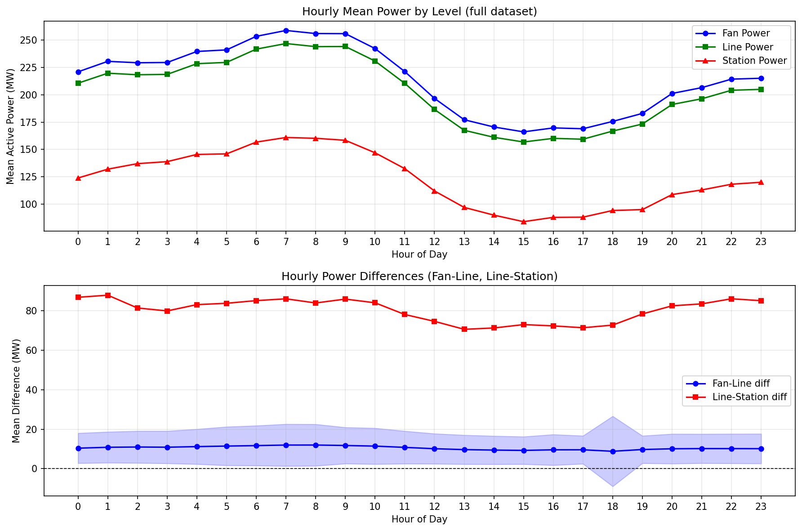

| 时间段 | FAN 均值 (MW) | Fan−Line 差值 (MW) |
|--------|-------------|------------------|
| 夜间（0～5时） | 229～241 | 10.4～11.5 |
| 早上（6～10时） | 242～259 | 11.5～12.0 |
| 正午（11～14时）| 170～221 | 9.4～10.8 |
| 下午（15～17时）| 166～169 | 9.3～9.6 |
| 傍晚（18～23时）| 175～215 | 8.8～10.2 |

**日内规律：**
- 风电功率在日出前（6～10时）达到峰值，正午后下降，这是广东地区海风/山风日内变化的典型特征。
- Fan−Line 差值与功率水平正相关，高峰时段（早上）差值较大，低谷时段（下午）较小。
- 小时级功率变化表明数据时间分辨率（分钟级）能够捕捉到日内风速波动。

---

## 12 差异原因分析

### 12.1 Fan − Line 差异原因（约 10～13 MW）

```
风机功率表（机舱或塔底）
        ↓
集电支路电缆（35kV）
        ↓
箱式变压器（低压→35kV）
        ↓  ← 此处有损耗：铜损 + 铁损
集电线路汇流
        ↓
集电线路测点（逆变器/测量 CT/PT）
```

| 原因类别 | 说明 | 估算影响 |
|---------|------|---------|
| **集电线路电阻损耗** | 电流经 35kV 集电电缆从风机到汇集站，$P = I^2 R$，随功率非线性增大 | 主要因素，约 5～25 MW |
| **箱式变压器铁芯损耗** | 变压器空载损耗（铁损），与负载无关，约为额定容量的 0.1～0.3% | 较小，约 1～3 MW |
| **计量位置差异** | 风机测量点在机舱/塔底，集电线路测量点在汇流站，路径差导致系统偏差 | 约 1～2 MW |
| **SCADA 时间同步** | 风机 SCADA 与线路 SCADA 可能存在 1～2 分钟时延，引入随机误差 | 随机波动 ±几 MW |
| **仪表系统误差** | 风机功率表精度（±1%～±2%）累积，137 台汇总后放大 | 约 1～5 MW |

### 12.2 Line − Station 差异原因（约 2 MW，在正常工况下）

```
集电线路汇集（110kV 母线）
        ↓
主变压器（110kV/220kV）
        ↓  ← 变压器铜损 + 厂用电从这里取电
升压站
        ↓
全站并网点 CT/PT（220kV 出线侧）
```

| 原因类别 | 说明 | 估算影响 |
|---------|------|---------|
| **场站厂用电** | 控制室照明、空调、通信、液压系统、冷却风扇等，全场约 1～3 MW | **主要因素** |
| **主变压器铜损** | 随负载变化，满负荷约 0.2～0.5% | 约 0.5～2 MW |
| **无功补偿设备** | 并联电容器或 SVG 的有功损耗 | 约 0.1～0.3 MW |
| **计量偏差** | 集电线路 CT/PT 与并网点 CT/PT 的综合误差 | ±约 0.5 MW |

### 12.3 全站功率 STATION 异常原因（主因）

| 阶段 | 表现 | 最可能原因 |
|------|------|-----------|
| 3月～6月（全零） | 4个月 STATION 持续为 0 | **SCADA 采集通道未接入/未投运**，或数据从数据库导出时对应字段未映射 |
| 7月（混合） | 零值+正值+少量负值并存 | **测点逐步接入调试阶段**，通道不稳定 |
| 8月～9月（大量负值）| 35～43% 的读数为负（约 -8 MW 均值）| **电流互感器极性接反**（CT 二次侧极性错误），导致功率计算符号取反 |
| 10月以后（基本正常）| 83～95% 正值 | **极性问题已修复**，测点恢复正常；残余零值为停机或停电时段 |

---

## 13 核心结论与建议

### 13.1 核心结论

#### 结论 1：三层功率层级差异符合物理规律，差值稳定可预期

在 STATION 测点正常的时期（2024 年 10月～12月），三层功率关系为：

```
FAN ≈ LINE + 10～16 MW（集电线路损耗，与功率水平正相关）
LINE ≈ STATION + 2～3 MW（场用电 + 主变损耗）
FAN ≈ STATION + 13～19 MW（综合差值）
```

三层功率在有效数据期间的相关系数均超过 0.9995，线性关系极强。

#### 结论 2：全站功率数据存在严重质量问题，影响 57% 的数据

- 前 4 个月（3月～6月）：**STATION 测点未投运**，全量为 0
- 7月～9月：**CT 极性错误**，产生大量负值（-8 MW 量级）
- 这两个阶段占总数据量的 57%，不可直接用于 Line−Station 差值分析

#### 结论 3：WU 线路异常偏高，需进一步核查

WU 线路的 Fan−Line 差值均值（6.17 MW）是 DING 线路（2.38 MW）的 2.6 倍，且两者台数相同（47 台 vs 43 台）。建议核查：
- WU 线路集电电缆规格（截面积、长度）是否与 BING/DING 差异显著
- WU 线路测点 CT/PT 变比系数是否配置正确

#### 结论 4：S1/S2 策略对 LINE 影响较大，对 FAN 影响较小

89.7% 的时刻有风机出现微小负功率（S1 vs S2 FAN 差异），但绝对量（0.82 MW 均值）对汇总功率影响有限。线路测点（LINE S1 vs S2 差异 1.23 MW）更多反映了计量系统极性问题的间接影响。

### 13.2 数据使用建议

| 用途 | 建议操作 |
|------|---------|
| **三层功率差值研究** | 仅使用 2024-10-01 之后的数据（STATION 测点可靠） |
| **年度发电量统计** | 使用 FAN_S2 或 LINE_S2，两者差异约 1.3%（线路损耗）|
| **全站发电量统计** | 修复 3月～9月 STATION 缺失值后再使用，或以 LINE_S2 代替 |
| **对比研究** | 分析 8月～9月的负值数据时需先取反：STATION_corrected = -STATION |
| **WU 线路数据** | 建议复核测点倍率，确认差值是否真实反映线路损耗 |

### 13.3 进一步分析建议

1. **长期损耗率监控**：计算每月 Fan−Line 损耗率（%），建立基准值，偏差超过 ±20% 时触发核查。
2. **厂用电分析**：在 STATION 测点可靠期间，持续统计 Line−Station 差值，分析厂用电季节性变化规律。
3. **单机功率偏差分析**：对各台风机的有功进行横向对比，识别长期低出力或数据异常的机组。
4. **测点极性验证**：对全场所有集电线路和全站测点进行极性检验，特别是 8月～9月发现的 CT 极性错误问题，需确认已彻底修复。

---

## 附录：可视化图表索引

| 图号 | 文件名 | 内容 |
|------|--------|------|
| 01 | `01_time_series.png` | 三层功率及差值时间序列（前30天） |
| 02 | `02_scatter_plots.png` | Fan/Line/Station 两两散点图（全量） |
| 03 | `03_diff_distribution.png` | 三种差值的直方图分布（全量） |
| 04 | `04_diff_by_power_level.png` | 按功率分段的差值箱线图 |
| 05 | `05_monthly_avg.png` | 月度平均功率对比柱状图 |
| 06 | `06_per_line_comparison.png` | 各线路测点 vs 对应风机汇总 |
| 07 | `07_station_zero_anomaly.png` | 全站功率异常归零分析 |
| 08 | `08_strategy_comparison.png` | S1 vs S2 策略差异影响 |
| 09 | `09_station_availability.png` | 月度 STATION 数据可用性堆叠图 |
| 10 | `10_fan_line_diff_vs_power.png` | Fan-Line 差值随功率变化趋势 |
| 11 | `11_scatter_station_valid.png` | STATION>0 时的散点图（含彩色编码） |
| 12 | `12_hourly_pattern.png` | 日内小时级功率规律 |
| 13 | `13_per_line_detailed.png` | 各线路散点图+差值分布（详细版） |
| 14 | `14_line_station_diff_valid.png` | STATION>0 时 Line-Station 差值分布与月趋势 |

所有图表位于：`DATA/峡阳B/analysis_output/`

---

*报告生成时间：2024年分析*  
*数据来源：峡阳B风电场 SCADA 系统*  
*分析脚本：`#7-2功率层级关系分析.py`*
